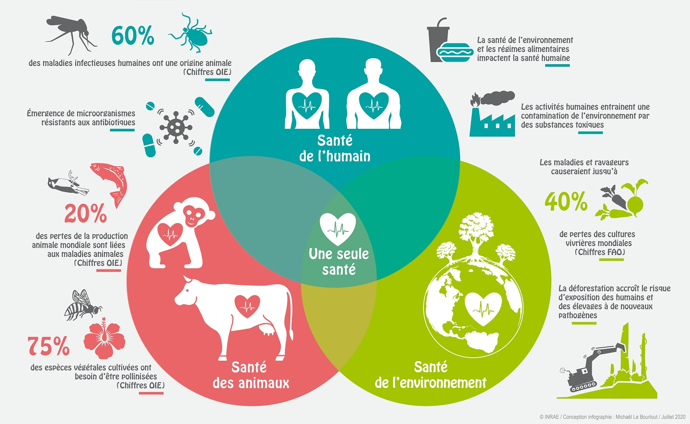
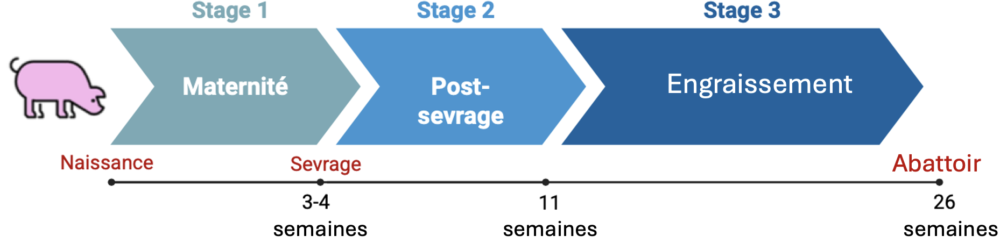



# Introduction

## La Surveillance de l’antibiorésistance : Projet EcoAntibio2

La découverte des antibiotiques au cours du XXe siècle a profondément transformé les médecines humaines et vétérinaires en permettant le traitement efficace d’un grand nombre d’infections bactériennes autrefois responsables d’une mortalité importante.
L’introduction de la pénicilline dans les années 1940 a notamment marqué le début d’une nouvelle ère thérapeutique, contribuant à l’amélioration considérable de l’espérance de vie et de la santé des populations.
En médecine vétérinaire, les antibiotiques ont également joué un rôle majeur dans l’amélioration de la santé animale, du bien-être des animaux d’élevage et de la sécurité sanitaire des productions alimentaires.

Cependant, l’utilisation massive et parfois inappropriée de ces molécules a favorisé l’émergence et la diffusion de bactéries résistantes aux traitements antimicrobiens.
L’antibiorésistance résulte en partie de la pression de sélection exercée par les antibiotiques sur les populations bactériennes, favorisant la survie et la multiplication des souches résistantes.
Bien qu’il s’agisse d’un phénomène biologique naturel, son accélération sous l’effet des activités humaines constitue aujourd’hui une préoccupation majeure pour la santé publique.

L’Organisation Mondiale de la Santé (OMS) considère désormais l’antibiorésistance comme l’une des principales menaces pesant sur la santé mondiale.
Les infections causées par des bactéries résistantes sont associées à une augmentation de la morbidité, de la mortalité, de la durée des hospitalisations et des coûts de traitement.

Face à cette situation, de nombreux pays ont mis en place des programmes de lutte contre l’antibiorésistance [@Eco1].
En France, plusieurs plans nationaux se sont succédé afin d’encadrer l’usage des antibiotiques et de développer la surveillance des bactéries résistantes.
Dans le domaine vétérinaire, le plan EcoAntibio a été lancé en 2012 avec pour objectif principal de réduire l’exposition des animaux aux antibiotiques tout en maintenant un niveau élevé de santé et de bien-être animal.
Cette stratégie reposait notamment sur la promotion des bonnes pratiques d’élevage, l’amélioration de la prévention sanitaire et le développement d’alternatives aux traitements antibiotiques.

La mise en œuvre des plans Écoantibio en France a permis une réduction importante de l'utilisation des antibiotiques chez les animaux de rente.
Entre 2011 et 2022, l'exposition globale des animaux aux antibiotiques a diminué de 52 % [@MedicamentsAntimicrobiensChez], témoignant des efforts réalisés par les éleveurs et les vétérinaires pour limiter le recours aux traitements antibiotiques tout en préservant la santé animale.
Cette baisse contribue également à la lutte contre l'antibiorésistance, un enjeu majeur de santé publique.

Les résultats obtenus lors de la première phase ont conduit à la mise en place du plan EcoAntibio 2 pour la période 2017-2022[@Eco3].
Ce second plan visait à consolider les progrès réalisés en renforçant la maîtrise de l’utilisation des antibiotiques critiques, en améliorant les mesures de biosécurité dans les élevages et en développant les systèmes de surveillance de l’antibiorésistance.
Il accordait également une place importante à la recherche scientifique afin de mieux comprendre les mécanismes d’émergence et de diffusion des bactéries résistantes.

Cette surveillance s’inscrit aujourd’hui dans une démarche intégrée dite One Health (« Une seule santé »), qui reconnaît les interactions étroites existant entre la santé humaine, la santé animale et l’environnement [@kimAntibioticResistomeOneHealth2021; @hernando-amadoDefiningCombatingAntibiotic2019a].
Cette approche repose sur le constat que les bactéries résistantes et leurs gènes de résistance circulent continuellement entre ces différents compartiments.
Ainsi, la compréhension des dynamiques de l’antibiorésistance nécessite de dépasser les approches sectorielles traditionnelles pour adopter une vision globale intégrant l’ensemble des acteurs et des écosystèmes concernés.

{#fig-onehealth}

Dans ce contexte, de nombreux projets de recherche ont été développés afin d’améliorer les connaissances sur les mécanismes de circulation des bactéries résistantes et des gènes de résistance aux antibiotiques.
Ces travaux visent notamment à identifier les réservoirs bactériens, les voies de transmission entre compartiments et les facteurs favorisant la dissémination de l’antibiorésistance.

Le présent travail s’inscrit dans cette dynamique de surveillance et de recherche.
Réalisée dans le cadre d’un programme consacré à l’étude de l’antibiorésistance à La Réunion, cette étude vise à mieux comprendre la circulation des entérobactéries résistantes aux antibiotiques au sein de la filière porcine réunionnaise.

Située dans le sud-ouest de l’océan Indien, La Réunion constitue un territoire particulièrement intéressant pour l’étude de l’antibiorésistance [@ReviewOI].
Son caractère insulaire offre un cadre d’étude relativement délimité géographiquement, tandis que l’organisation structurée des filières d’élevage facilite l’analyse des flux d’animaux et des interactions entre acteurs.
Plusieurs études menées à La Réunion au cours des dernières années ont permis de documenter la circulation des bactéries résistantes aux antibiotiques dans différents compartiments animaux [@ReviewOI; @Farm2018; @antoniolliEvaluationConsommationDantibiotiques2021; @miltgenOneHealthCompartmental2022].
Ces travaux ont mis en évidence une diminution significative de la prévalence de l'antibiorésistance dans les élevages bovins, avicoles et de petits ruminants au cours de la dernière décennie.
Cette évolution s'inscrit dans un contexte de réduction de l'exposition des animaux aux antibiotiques et d'amélioration des pratiques d'élevage.
Toutefois, l'antibiorésistance demeure un phénomène dynamique, dont les niveaux et les profils peuvent évoluer au fil du temps.
Par ailleurs, les connaissances restent limitées pour certaines productions animales, notamment la filière porcine.
Dans ce contexte, la mise en œuvre d'études spécifiques apparaît nécessaire afin de mieux caractériser la présence, la circulation et l'évolution des bactéries résistantes au sein de ce secteur de production.

Ainsi, cette étude s’inscrit pleinement dans les objectifs des programmes nationaux de lutte contre l’antibiorésistance en contribuant à l’amélioration des connaissances sur les dynamiques de circulation des bactéries résistantes dans un territoire insulaire et dans une filière d’élevage encore peu documentée.

## L’antibiorésistance : un enjeu de santé publique

### Résistance et persistance chez les bactéries

L’antibiorésistance est définie comme la capacité d’une bactérie à résister à l’action d’un ou plusieurs antibiotiques, lui permettant de survivre ou de se multiplier malgré l’exposition à ces agents antimicrobiens.
Il convient de préciser que cette résistance est portée par les bactéries elles-mêmes, par l’acquisition ou la sélection de mécanismes de résistance, et non par l’hôte infecté, qu’il soit humain ou animal.

Il convient également de distinguer l'antibiorésistance des phénomènes de persistance bactérienne, qui correspondent à une forme de tolérance transitoire aux antibiotiques [@meca1].
Les bactéries persistantes ne possèdent pas nécessairement de gènes de résistance et demeurent généralement sensibles aux antibiotiques lorsque leur sensibilité est évaluée par les méthodes conventionnelles.
Elles appartiennent à une fraction minoritaire de la population bactérienne capable d’entrer dans un état physiologique particulier caractérisé par un ralentissement marqué, voire un arrêt temporaire, de l’activité métabolique et de la multiplication cellulaire.
Dans cet état, ces cellules échappent à l’action des traitements.
Après la disparition de l’antibiotique, elles sont capables de reprendre leur croissance et de recoloniser leur environnement.

La résistance aux antibiotiques, quant à elle, peut être intrinsèque ou acquise.
La résistance intrinsèque résulte des caractéristiques naturelles propres à une espèce bactérienne.
La résistance acquise apparaît quant à elle à la suite de modifications génétiques, soit par mutation au sein du génome bactérien, soit par acquisition de gènes de résistance provenant d’autres bactéries [@meca].
Ces mécanismes permettent aux bactéries de s’adapter rapidement aux pressions de sélection exercées par leur environnement et constituent un moteur majeur de leur évolution.

Sous l’effet de la pression de sélection exercée par les antibiotiques, les bactéries sensibles sont éliminées (dans le cas des antibiotiques bactéricides) ou leur croissance est fortement inhibée (dans le cas des antibiotiques bactériostatiques), tandis que les bactéries résistantes survivent et continuent à se multiplier.
L’utilisation répétée ou inappropriée des antibiotiques favorise ainsi progressivement la sélection de populations bactériennes résistantes.
Ce phénomène est observé aussi bien en médecine humaine qu’en médecine vétérinaire.
Les antibiotiques jouent pourtant un rôle essentiel dans le traitement des infections bactériennes, mais leur utilisation exerce inévitablement une pression sélective favorisant l’émergence et la diffusion des résistances.

Le maintien des mécanismes de résistance peut cependant représenter un coût biologique pour la bactérie, notamment en raison des ressources nécessaires à l’expression et à la réplication des gènes de résistance [@meca2].
En théorie, une diminution durable de la pression antibiotique devrait donc conduire à une réduction de la fréquence de ces gènes au sein des populations bactériennes.
Toutefois, cette réversibilité est souvent incomplète [@meca21].
Certains déterminants de résistance présentent un faible coût de maintien ou font l’objet de mutations compensatrices limitant leur impact sur la valeur sélective des bactéries.

De plus, les gènes de résistance sont fréquemment portés par des éléments génétiques mobiles, tels que les plasmides, capables de persister dans les populations bactériennes grâce à différents mécanismes [@meca31].
Parmi ceux-ci figurent les systèmes de toxine-antitoxine ("plasmid addiction systems"), qui entraînent la mort ou l’inhibition des bactéries ayant perdu le plasmide, favorisant ainsi sa conservation [@meca3].
La co-sélection constitue également un mécanisme majeur : un même élément génétique mobile peut porter simultanément des gènes de résistance à plusieurs antibiotiques, à des métaux lourds ou à des biocides, de sorte que la sélection exercée sur un caractère favorise indirectement le maintien de l’ensemble de l’élément génétique.
Enfin, certains plasmides confèrent à leur hôte la capacité de produire des molécules antibactériennes, telles que les colicines, qui éliminent préférentiellement les bactéries concurrentes ne portant pas le plasmide.
Les bactéries résistantes bénéficient alors d'une diminution de la compétition pour les ressources et les niches écologiques disponibles, ce qui favorise leur persistance et leur expansion dans la population bactérienne.
Ainsi, la persistance des gènes de résistance ne dépend pas uniquement de l’utilisation des antibiotiques.

Les mécanismes de résistance aux antibiotiques sont variés [@meca4].
Certaines bactéries produisent des enzymes capables d’inactiver les molécules antibiotiques avant qu’elles n’atteignent leur cible.
C’est notamment le cas des β-lactamases, enzymes capables d’hydrolyser les antibiotiques appartenant à la famille des β-lactamines.
D’autres mécanismes reposent sur la modification de la cible de l’antibiotique, la diminution de la perméabilité membranaire ou encore l’expulsion active du composé grâce à des pompes d’efflux.
Plusieurs de ces mécanismes peuvent coexister au sein d’une même bactérie, conduisant à l’apparition de phénotypes de multirésistance.

![Schéma des modes d'action des β-lactamines (Source : [@zotero-item-441]).](images/fig2.png){#fig-méca}

Parmi les mécanismes de résistance les plus préoccupants figure la production de β-lactamases à spectre étendu (BLSE).
Ces enzymes confèrent une résistance à un large éventail de β-lactamines, notamment aux céphalosporines de troisième génération.
Ces dernières sont considérées comme des antibiotiques d’importance critique pour la médecine humaine, car elles constituent souvent l’une des dernières options thérapeutiques disponibles pour le traitement d’infections bactériennes graves.
Afin de préserver leur efficacité, leur utilisation est strictement encadrée et limitée en médecine vétérinaire dans l'Union européenne et plus largement dans de nombreux pays à revenu élevé[@meca6].

Les gènes codant les BLSE sont fréquemment portés par des plasmides, favorisant leur diffusion rapide entre bactéries par transfert horizontal de gènes.
La circulation mondiale des entérobactéries productrices de BLSE (E-BLSE) est aujourd’hui reconnue comme un enjeu majeur de santé publique en raison de leur capacité à compromettre l’efficacité de traitements antibiotiques essentiels et à se diffuser entre les compartiments humain, animal et environnemental.

### Les entérobactérie un modèle pertinent de l’antibiorésistance en approche One Health

La persistance des bactéries résistantes et des déterminants génétiques de résistance au sein des populations bactériennes soulève une problématique qui dépasse largement le cadre de l'individu ou de l'exploitation d'origine.
En effet, l’antibiorésistance ne se limite pas au secteur médical ou hospitalier [@kimAntibioticResistomeOneHealth2021; @hernando-amadoDefiningCombatingAntibiotic2019a].
Les bactéries résistantes ainsi que les gènes de résistance circulent continuellement entre les populations humaines, les animaux domestiques, la faune sauvage et les différents compartiments environnementaux.
Les effluents d’élevage, les lisiers, les eaux usées, les sols agricoles, les cours d’eau, la chaîne alimentaire ou encore les déplacements d’animaux, de personnes et de marchandises constituent autant de voies potentielles de diffusion.
Ainsi, les bactéries résistantes sélectionnées dans un compartiment peuvent être transférées vers un autre, contribuant à la dissémination globale de l’antibiorésistance.

L'interconnexion entre les compartiments humain, animal et environnemental place le concept One Health au cœur de la compréhension et de la gestion de cette problématique.
Cette approche repose sur le principe selon lequel la santé humaine, la santé animale et la santé des écosystèmes sont étroitement liées et interdépendantes.
Dans le cas de l’antibiorésistance, il apparaît désormais impossible de considérer ces compartiments de manière isolée, tant les échanges de bactéries et de gènes de résistance sont fréquents.
L’étude de l’antibiorésistance nécessite donc une approche multidisciplinaire intégrant simultanément les dimensions médicales, vétérinaires et environnementales afin de mieux comprendre les mécanismes de circulation des résistances et de développer des stratégies de surveillance et de contrôle adaptées.

Cela met, également, en évidence la nécessité d’identifier les principaux réservoirs et vecteurs impliqués dans la circulation des gènes de résistance entre les différents compartiments.
Parmi les bactéries jouant un rôle majeur dans ces échanges figurent les entérobactéries, en raison de leur présence ubiquitaire, de leur capacité à coloniser de nombreux hôtes et de leur aptitude à acquérir et disséminer des gènes de résistance aux antibiotiques.
De ce fait, elles constituent un modèle d’étude particulièrement pertinent pour comprendre les mécanismes d’émergence, de maintien et de diffusion de l’antibiorésistance dans une approche One Health.

Les entérobactéries, récemment regroupées au sein de l’ordre des *Enterobacterales* constituent un groupe de bactéries à Gram négatif largement distribuées dans l’environnement.
Elles colonisent naturellement le tractus digestif des humains et des animaux mais peuvent également être retrouvées dans les sols, les eaux de surface et les effluents d’élevage.
Parmi les espèces les plus connues figurent *Escherichia coli*, *Klebsiella pneumoniae*, *Enterobacter spp*.
ou encore *Salmonella spp.* Certaines sont commensales et participent à l’équilibre du microbiote intestinal, tandis que d’autres, ou ces mêmes espèces dans certaines conditions, peuvent agir comme des pathogènes opportunistes et être responsables d’infections digestives, urinaires, respiratoires ou systémiques.

Naturellement excrétées dans les matières fécales, elles peuvent être disséminées dans l’environnement à travers les effluents d’élevage, les lisiers [@entero1], les eaux usées ou les eaux de ruissellement [@entero2].
Cette circulation entre les compartiments humain, animal et environnemental favorise leur diffusion à grande échelle.
Par ailleurs, plusieurs espèces appartenant à l’ordre des *Enterobacterales*, telles que *Escherichia coli* ou *Klebsiella pneumoniae*, figurent parmi les principaux agents pathogènes opportunistes responsables d’infections chez l’Homme, faisant de ce groupe bactérien une réelle menace pour la santé humaine.
Leur capacité à acquérir et à disséminer de nombreux mécanismes de résistance aux antibiotiques en fait des acteurs majeurs de la crise actuelle de l’antibiorésistance et des organismes modèles particulièrement pertinents pour l’étude de cette problématique dans une approche One Health[@entero3].

Dans les élevages porcins, les entérobactéries intestinales présentent un intérêt particulier [@leePrevalenceCharacteristicsClonal2021].
Le lisier constitue un important réservoir de bactéries et de gènes de résistance aux antibiotiques.
Lors du stockage puis de l’épandage agricole, ces bactéries peuvent être transférées vers les sols et rejoindre les milieux aquatiques par lessivage ou ruissellement.
Les cours d’eau, les eaux souterraines ou encore les zones côtières peuvent ainsi devenir des interfaces favorisant la persistance et la dissémination environnementale de l’antibiorésistance[@entero2].
Les entérobactéries apparaissent ainsi comme d’excellents bio-indicateurs de la circulation des résistances dans les écosystèmes agricoles.

Au-delà de leur large distribution, les entérobactéries présentent une capacité remarquable à acquérir et transmettre des gènes de résistance aux antibiotiques.
Cette aptitude repose notamment sur les mécanismes de transfert horizontal de gènes.
Contrairement à la transmission verticale, qui correspond à la transmission du matériel génétique d’une bactérie mère à ses descendantes, le transfert horizontal permet l’échange de matériel génétique entre bactéries appartenant parfois à des espèces, voire à des genres différents [@meca].
Ce phénomène joue un rôle majeur dans l’émergence et la diffusion rapide de l’antibiorésistance au sein des populations bactériennes.

Ces transferts impliquent fréquemment des éléments génétiques mobiles tels que les plasmides, les intégrons ou les transposons.
Ces éléments peuvent porter simultanément plusieurs gènes de résistance dirigés contre différentes familles d’antibiotiques.
Ainsi, une bactérie peut acquérir rapidement un phénotype de multirésistance et contribuer à sa propagation chez les animaux, dans l’environnement ou chez l’Homme.

Ainsi, les entérobactéries constituent de bons indicateurs de la circulation de l’antibiorésistance au sein des élevages [@entero3].
Leur prévalence reflète en partie les pressions de sélection exercées par l’usage des antibiotiques, mais également d’autres mécanismes favorisant le maintien et la diffusion des gènes de résistance.
L’étude des entérobactéries et des éléments génétiques qu’elles hébergent permet donc d’appréhender les dynamiques de circulation et de maintien de ces déterminants entre les animaux, les bâtiments d’élevage et l’environnement.
Dans ce contexte, elles constituent un modèle particulièrement pertinent pour évaluer les flux de résistance entre les différents compartiments de l’approche One Health.
La compréhension de l’épidémiologie et de la persistance de l’antibiorésistance nécessite ainsi de caractériser les éléments génétiques associés aux gènes de résistance ainsi que les mécanismes favorisant leur transmission et leur maintien au sein des populations bactériennes.

### Un état des lieux de l’antibiorésistance à La Réunion

Située dans le sud-ouest de l’océan Indien, La Réunion est un territoire insulaire de 2 512 km².
Malgré sa superficie limitée, l’île abrite une population de plus de 870 000 habitants ainsi qu’une activité agricole diversifiée reposant sur les filières bovine, porcine, avicole, des petits ruminants, cunicole, apicole et aquacole, mais également sur les cultures de canne à sucre, les productions maraîchères, fruitières, d’épices et de vanille.
Cette forte densité de population, associée à la proximité entre activités humaines, élevages, espaces naturels et milieux aquatiques, en fait un territoire particulièrement pertinent pour l’étude des dynamiques de circulation de l’antibiorésistance.
De plus, la présence d’importantes populations de carnivores domestiques errants ou divagants ainsi que de rongeurs susceptibles de fréquenter simultanément les environnements anthropisés, agricoles et naturels favorise les interactions entre compartiments et pourrait contribuer à la dispersion des bactéries résistantes et des gènes de résistance à l’échelle du territoire.

L’agriculture réunionnaise occupe une place importante dans l’aménagement du territoire.
Les effluents issus des élevages sont régulièrement valorisés par épandage agricole, notamment sous forme de lisiers ou de fumiers.
Ces pratiques contribuent au recyclage des éléments nutritifs mais peuvent également favoriser la dissémination de bactéries résistantes et de gènes de résistance dans les sols agricoles.
Une fois introduits dans l’environnement, ces microorganismes peuvent persister, être transportés par les eaux de ruissellement ou rejoindre les milieux aquatiques superficiels et souterrains.

Les conditions climatiques tropicales de l’île, caractérisées par des températures favorables à l’activité microbienne et des épisodes pluvieux parfois intenses, peuvent également influencer la survie et la dispersion de ces bactéries dans l’environnement.
Les interfaces étroites entre élevages, zones urbaines, cours d’eau et écosystèmes naturels favorisent potentiellement les échanges microbiologiques entre les différents compartiments de l’approche One Health.
À ces interactions environnementales s’ajoutent les contacts directs liés aux activités professionnelles exposant régulièrement les individus aux animaux, aux effluents d’élevage ou aux milieux contaminés.
Ces multiples interfaces contribuent à la circulation des bactéries résistantes et des gènes de résistance à l’échelle du territoire réunionnais.

De plus, le caractère insulaire de La Réunion constitue un avantage pour l’étude épidémiologique de l’antibiorésistance.
L’absence d’importation d’animaux vivants vers l’île, associée à une circulation géographiquement contrainte des personnes et des marchandises, facilite l’identification des voies potentielles d’introduction et de diffusion des bactéries résistantes.
Cette relative délimitation géographique permet d’appréhender plus finement les mécanismes de circulation des bactéries résistantes entre les compartiments humain, animal et environnemental.

Dans ce contexte, plusieurs travaux ont été réalisés au sein des unités du CIRAD ces dernières années afin d’évaluer la présence de bactéries résistantes aux antibiotiques au sein des différents compartiments réunionnais.
Ces études mettent en évidence la circulation de bactéries porteuses de mécanismes de résistance d’intérêt majeur en santé publique, notamment des entérobactéries productrices de β-lactamases à spectre étendu (E-BLSE).
Dans les élevages porcins réunionnais, la prévalence des E-BLSE au niveau des exploitations, en 2016, a notamment été estimée à plus de 50 %, soulignant l’importance de ce réservoir animal dans l’épidémiologie locale de l’antibiorésistance [@Farm2018; @miltgenOneHealthCompartmental2022].
Des travaux plus récents de 2018 confirment cette large diffusion des E-BLSE au sein de la filière porcine réunionnaise et mettent en évidence la circulation de clones bactériens et d’éléments génétiques mobiles associés aux gènes de résistance.
Ces résultats soulignent l’intérêt de poursuivre les investigations sur les mécanismes impliqués dans le maintien et la dissémination de ces résistances à l’interface entre les compartiments animal, humain et environnemental.

Par ailleurs, une synthèse récente consacrée à l’antibiorésistance dans les territoires du sud-ouest de l’océan Indien [@ReviewOI] a mis en évidence la présence de nombreux pathogènes prioritaires résistants aux antibiotiques dans la région tout en soulignant l’insuffisance de données permettant d’étudier les échanges entre les compartiments humain, animal et environnemental.

Malgré les travaux réalisés au cours de la dernière décennie, la surveillance de l'antibiorésistance dans la filière porcine réunionnaise demeure essentielle.
En effet, les niveaux de résistance bactérienne sont susceptibles d'évoluer au fil du temps sous l'influence de multiples facteurs, tels que les modifications des pratiques d'élevage, l'amélioration de la biosécurité, les évolutions de l'usage des antibiotiques ou encore les changements environnementaux.
Les mesures mises en œuvre dans le cadre des plans de maîtrise de l'antibiorésistance ont probablement contribué à réduire l'exposition des animaux aux antibiotiques et, potentiellement, la prévalence des bactéries résistantes.
Toutefois, compte tenu du caractère dynamique de ces phénomènes, un suivi régulier apparaît nécessaire afin de documenter l'évolution des résistances au sein des élevages porcins et d'évaluer l'impact des actions de prévention mises en place.

## Fonctionnement d'un élevage porcin et organisation de la filière réunionnaise

La compréhension de la circulation des bactéries résistantes aux antibiotiques nécessite une connaissance préalable du fonctionnement des élevages porcins.
En effet, les pratiques d’élevage, l’organisation des bâtiments et la gestion sanitaire influencent directement les interactions entre animaux et la diffusion des microorganismes.

### Structure générale d'un élevage porcin

Un élevage porcin est organisé autour du cycle biologique du porc, depuis la reproduction jusqu’à l’abattage.
Les élevages peuvent être spécialisés dans une phase de production ou fonctionner selon un modèle dit « naisseur-engraisseur ».
Dans ce cas, l’exploitation regroupe l’ensemble des étapes de production : gestion des truies reproductrices, naissance des porcelets, sevrage, croissance et engraissement jusqu’au poids d’abattage.
À La Réunion, ce modèle naisseur-engraisseur est très largement majoritaire, ce qui implique une organisation interne complexe et une gestion sanitaire rigoureuse.

L’élevage porcin est organisé en plusieurs unités fonctionnelles correspondant aux différents stades physiologiques et zootechniques des animaux : quarantaine, gestation-verraterie, maternité, post-sevrage, engraissement et locaux techniques [@pig1].
Cette structuration répond à un double objectif : optimiser les performances de production tout en assurant une maîtrise sanitaire rigoureuse.
Chaque catégorie d’animaux possède en effet des besoins spécifiques en matière d’ambiance (température, ventilation et hygrométrie), d’alimentation, de densité d’élevage et de suivi vétérinaire.

Cette séparation des secteurs permet également de limiter les contacts entre animaux d’âges différents, ce qui constitue un principe fondamental de prévention sanitaire.
Les jeunes animaux étant particulièrement sensibles aux agents infectieux, la sectorisation des bâtiments contribue à réduire la circulation des agents pathogènes au sein de l’élevage et facilite la mise en œuvre des mesures de biosécurité.

La quarantaine constitue généralement la première étape lors de l’introduction de nouveaux animaux dans l’élevage.
Elle permet d’isoler temporairement les reproducteurs nouvellement acquis afin de limiter l’introduction de nouveaux agents pathogènes dans le troupeau.

Après leur introduction ou leur retour de maternité, les truies rejoignent le secteur de gestation, également appelé verraterie.
Cette phase débute après l’insémination et se poursuit pendant environ 114 jours jusqu’à la mise bas.
Cette étape est essentielle pour assurer le suivi de la reproduction et le bon déroulement de la gestation.

En fin de gestation, les truies sont transférées en maternité où se déroulent la mise bas et l’allaitement des porcelets.
Cette phase est essentielle car les nouveau-nés présentent une forte sensibilité aux infections et dépendent largement de l’immunité transmise par le colostrum maternel.
Les conditions d’ambiance doivent donc être strictement contrôlées afin de limiter le stress des truies et la mortalité néonatale.

À l’issue du sevrage, soit généralement trois à quatre semaines après la naissance, les porcelets sont transférés dans les salles de post-sevrage, période reconnue comme particulièrement critique sur le plan sanitaire.
Le sevrage entraîne en effet plusieurs facteurs de stress : séparation de la mère, changement progressif d’alimentation, mélange d’animaux et adaptation à un nouvel environnement.
Cette étape correspond également à une phase de transition immunitaire durant laquelle les anticorps maternels diminuent alors que le système immunitaire des porcelets reste immature.
Ces conditions favorisent l’apparition de troubles digestifs et respiratoires, expliquant le recours plus fréquent aux traitements antibiotiques durant cette phase de production.

Après plusieurs semaines de croissance, les animaux rejoignent les salles d’engraissement, dernière étape du cycle de production avant l’abattage.
L’objectif de cette phase est d’amener progressivement les porcs au poids commercial tout en maintenant de bonnes performances zootechniques et sanitaires.
Même si les animaux y sont généralement plus résistants qu’en post-sevrage, les densités élevées et les interactions entre individus peuvent favoriser la diffusion d’agents infectieux, notamment respiratoires.

Enfin, les porcs sont envoyés à l’abattoir lorsqu’ils atteignent leur poids commercial, généralement entre cinq et six mois d’âge.
La durée relativement longue du cycle de production, associée aux mouvements successifs des animaux entre les différents secteurs, nécessite l’application rigoureuse de mesures de biosécurité afin de limiter la circulation des agents pathogènes au sein des exploitations.

{#fig-chrono}

### Planification opérationnelle - La conduite en bande

La gestion d’un élevage porcin repose sur une planification rigoureuse des mouvements d’animaux et des interventions techniques tout au long du cycle de production.
Dans la majorité des élevages réunionnais, l’organisation est fondée sur le principe de la conduite en bandes [@pig2].
Ce système consiste à regrouper les animaux selon leur âge et leur stade physiologique afin qu’ils progressent collectivement à travers les différents ateliers de l’exploitation.

Les truies sont ainsi réparties en plusieurs bandes reproductives dont les cycles sont synchronisés.
Les opérations de reproduction, de mise bas, de sevrage et de transfert des animaux ont lieu à intervalles réguliers pour l’ensemble des animaux appartenant à une même bande.
Selon les élevages, l’intervalle entre deux bandes peut varier d'une à plusieurs semaines.
Cette organisation permet de mieux répartir la charge de travail, d’optimiser l’utilisation des bâtiments et de faciliter le suivi zootechnique et sanitaire des animaux.

La conduite en bandes présente également un intérêt majeur en matière de biosécurité [@pig1].
En regroupant les animaux d’un même âge, elle limite les contacts entre individus présentant des statuts sanitaires différents.
Les porcelets, particulièrement sensibles aux maladies infectieuses, sont ainsi séparés des animaux plus âgés qui peuvent constituer des réservoirs de pathogènes.

Cette organisation est étroitement associée au principe du « tout plein-tout vide ».
Selon cette méthode, une salle ou un bâtiment est entièrement rempli par un même lot d’animaux puis totalement vidé lorsque ceux-ci passent à l’étape de production suivante.
Une fois les animaux sortis, le bâtiment reste vide le temps nécessaire au nettoyage, à la désinfection et au séchage des installations avant l’arrivée du lot suivant.
L’absence de chevauchement entre deux bandes permet de rompre les cycles de contamination et de réduire l’accumulation des micro-organismes dans l’environnement d’élevage.

La conduite en bandes facilite également l’application de la marche en avant.
Ce principe repose sur une circulation organisée des animaux, du personnel et du matériel des zones présentant le statut sanitaire le plus élevé vers les zones les plus exposées aux agents pathogènes.
En pratique, les interventions sont généralement réalisées en commençant par les secteurs accueillant les animaux les plus jeunes, tels que la maternité ou le post-sevrage, avant de terminer par les ateliers hébergeant les animaux les plus âgés.
Cette organisation limite les risques de contamination croisée entre les différents secteurs de production.

Sur le plan sanitaire, l’association de la conduite en bandes, du tout plein-tout vide et de la marche en avant contribue à diminuer la pression infectieuse au sein des élevages.
La réduction de la circulation des agents pathogènes permet d’améliorer les performances zootechniques, de limiter l’apparition de maladies et de réduire le recours aux traitements médicamenteux.
Ces principes constituent aujourd’hui des éléments fondamentaux des programmes de biosécurité mis en œuvre dans les élevages porcins modernes et participent à la maîtrise du risque de diffusion de bactéries résistantes aux antibiotiques.

### Biosécurité et gestion des effluents

À La Réunion, comme dans de nombreuses régions à forte densité d’élevage, la production porcine repose majoritairement sur des systèmes hors-sols.
Dans ce mode de production, les animaux sont élevés dans des bâtiments spécialisés où les paramètres d’ambiance, d’alimentation et de conduite sanitaire sont étroitement contrôlés.
Ce système permet d’optimiser les performances zootechniques tout en assurant une meilleure maîtrise des risques sanitaires.

Cependant, la concentration d’un grand nombre d’animaux dans des espaces limités favorise également la circulation des microorganismes.
Lorsqu’une bactérie résistante est introduite dans un élevage, elle peut rapidement être diffusée entre animaux par contact direct ou indirect, via les surfaces, le matériel d’élevage, les intervenants extérieurs ou les effluents.
Les bâtiments porcins représentent ainsi des environnements particulièrement favorables aux échanges microbiologiques.

La gestion des déjections constitue un enjeu majeur dans ce contexte[@entero1].
Les porcs excrètent quotidiennement une grande quantité de bactéries intestinales, dont certaines peuvent être porteuses de gènes de résistance aux antibiotiques.
Ces bactéries s’accumulent dans le lisier, qui représente un réservoir important de microorganismes et de gènes de résistance.
Après stockage, les lisiers sont généralement valorisés par épandage agricole.
Cette pratique permet le recyclage des éléments nutritifs mais participe également à l’introduction de bactéries résistantes dans les sols agricoles.

À travers les phénomènes de ruissellement et de lessivage, certaines bactéries peuvent ensuite rejoindre les eaux superficielles ou souterraines et contribuer à la circulation environnementale de l’antibiorésistance.
La gestion des effluents apparait donc comme une composante essentielle des approches One Health visant à comprendre les interactions entre élevage, environnement et santé publique.
Afin de limiter ces risques, les élevages porcins mettent en œuvre différentes mesures de biosécurité.
Parmi celles-ci figurent la conduite en bandes, le système « tout plein-tout vide», la marche en avant ainsi que les protocoles de nettoyage et de désinfection entre deux lots d’animaux.
Ces mesures visent à réduire la pression infectieuse au sein des bâtiments et à limiter les possibilités de transmission des agents pathogènes.

La maîtrise des maladies infectieuses contribue indirectement à réduire l’utilisation des antibiotiques en diminuant la fréquence des traitements nécessaires.
La vaccination participe également à cet objectif en permettant la prévention de nombreuses maladies d’élevage et en réduisant ainsi le recours aux traitements antibiotiques.
La biosécurité apparaît ainsi comme l’un des leviers les plus importants pour limiter la sélection et la diffusion des bactéries résistantes au sein des élevages porcins.

L’utilisation des antibiotiques en élevage constitue un enjeu majeur dans la lutte contre l’antibiorésistance.
Historiquement, ces molécules ont largement contribué à l’amélioration de la santé animale et des performances zootechniques en permettant la prévention et le traitement de nombreuses infections bactériennes.
Jusqu’en 2006, certains antibiotiques étaient également utilisés comme facteurs de croissance afin d’améliorer les performances de production et l’efficacité alimentaire des animaux d’élevage.
Cependant, leur usage répété exerce une pression de sélection sur les populations bactériennes présentes dans les élevages, favorisant l’émergence et la persistance de bactéries résistantes.
Dans les filières de production hors sol, telles que la filière porcine, cette problématique a suscité une attention croissante de la part des autorités sanitaires, des organisations professionnelles et des acteurs de la recherche.

Au cours des dernières décennies, plusieurs mesures réglementaires et techniques ont été mises en œuvre afin de réduire l’exposition des animaux aux antibiotiques.
L’interdiction de l’utilisation des antibiotiques comme facteurs de croissance au sein de l’Union européenne a constitué une première étape importante.
Plus récemment, les plans EcoAntibio ont encouragé le développement d’une utilisation plus raisonnée des traitements antibiotiques en favorisant la prévention des maladies plutôt que leur traitement systématique.
En filière porcine, avant la mise en place des plans EcoAntibio, l’administration préventive d’antibiotiques au sevrage était une pratique courante.
Les porcelets recevaient fréquemment pendant 15 à 21 jours des aliments médicamenteux contenant au moins un antibiotique, notamment de la colistine et/ou de la doxycycline.
La réduction progressive de ces pratiques, puis leur interdiction en 2012, a fortement contribué à la diminution de l’exposition des animaux aux antibiotiques observée au cours de la dernière décennie.

Dans les élevages porcins, cette évolution s’est traduite par un renforcement des mesures de biosécurité, une amélioration des conditions d’élevage et une optimisation du suivi sanitaire des animaux.
Le développement de la vaccination, l’amélioration de l’ambiance des bâtiments, la gestion des densités animales ou encore la mise en œuvre de protocoles rigoureux de nettoyage et de désinfection ont contribué à réduire l’incidence de certaines maladies infectieuses et, par conséquent, le recours aux antibiotiques.

Ces efforts ont permis une diminution significative de l’usage des antibiotiques en production animale au cours des dernières années.
En France, l’exposition globale des animaux aux antibiotiques a diminué de plus de 50 % entre 2011 et 2022 grâce aux plans EcoAntibio [@MedicamentsAntimicrobiensChez].
Dans la filière porcine, cette réduction s’est notamment accompagnée d’une remise en question des usages prophylactiques autrefois fréquents, en particulier au sevrage, où l’administration d’aliments médicamenteux contenant des antibiotiques pendant plusieurs semaines constituait une pratique courante.
Les stratégies de prévention ont progressivement remplacé ces approches systématiques, conduisant à une diminution marquée du recours aux traitements antimicrobiens.
Cette évolution témoigne de l’engagement des professionnels de l’élevage dans la lutte contre l’antibiorésistance et de l’efficacité des mesures de prévention mises en place.
Parallèlement, le cadre réglementaire a été renforcé afin de promouvoir un usage plus raisonné des antibiotiques et de limiter toute incitation économique susceptible de favoriser leur prescription ou leur utilisation.

Toutefois, la réduction de l’usage des antibiotiques ne se traduit pas nécessairement par la disparition des bactéries résistantes.
Les gènes de résistance peuvent persister durablement au sein des populations bactériennes et continuer à circuler entre animaux, bâtiments d’élevage et environnement.
De plus, certains mécanismes de résistance sont portés par des éléments génétiques mobiles capables de se maintenir même en l’absence de pression antibiotique directe (notamment grâce à des mécanisme de co-sélection).
Ainsi, malgré les progrès réalisés en matière de maîtrise des usages, l’antibiorésistance demeure une problématique importante nécessitant une surveillance continue.

Dans ce contexte, il apparaît essentiel d’évaluer non seulement les pratiques d’utilisation des antibiotiques, mais également les modalités de circulation des bactéries résistantes au sein des élevages.
L’étude des entérobactéries résistantes dans la filière porcine réunionnaise s’inscrit dans cette démarche et vise à mieux comprendre les interactions entre pratiques d’élevage, environnement et diffusion de l’antibiorésistance.
Elle contribue ainsi aux objectifs poursuivis par les programmes nationaux et internationaux de lutte contre l’antibiorésistance dans une approche intégrée One Health.

### Organisation en filière - CPPR

La filière porcine réunionnaise présente une organisation particulièrement structurée, qui constitue une spécificité importante du territoire.
Dans un contexte insulaire marqué par des contraintes foncières, économiques et logistiques, la production est majoritairement organisée autour de la Coopérative des Producteurs de Porcs de La Réunion (CPPR), qui joue un rôle central dans l’approvisionnement, le suivi technique des élevages, la sélection génétique et la commercialisation des animaux.
La filière organisée regroupe environ 180 éleveurs répartis dans 129 exploitations et représente près de 89 % de la production porcine locale, les éleveurs indépendants assurant le reste de la production.

En 2024, la production porcine réunionnaise s’élevait à 11 436 tonnes équivalent carcasse.
Elle permet de couvrir la quasi-totalité des besoins en viande de porc fraîche de l’île, mais seulement un peu plus de la moitié du marché porcin global, qui reste en partie dépendant des importations, notamment pour les produits congelés et transformés.

La CPPR intervient notamment dans la gestion du renouvellement des reproducteurs et l’approvisionnement en semence destinée à l’insémination artificielle.
Cette centralisation contribue à homogénéiser les performances zootechniques des élevages mais influence également les flux d’animaux et de matériel au sein de la filière.
L’utilisation largement répandue de l’insémination artificielle limite certains mouvements de reproducteurs vivants et participe à la maîtrise sanitaire des élevages.

La filière s’appuie également sur plusieurs outils collectifs tels que les structures d’abattage, de transformation et les services techniques spécialisés.
Cette organisation favorise une diffusion relativement homogène des pratiques d’élevage, de biosécurité et de gestion sanitaire entre les exploitations adhérentes.

D’un point de vue épidémiologique, cette structuration est particulièrement intéressante.
Les échanges d’animaux, les interventions techniques, les circuits d’approvisionnement ou encore les filières de gestion des effluents créent un ensemble de connexions susceptibles d’influencer la circulation des microorganismes au sein de la production porcine.
À l’inverse, l’encadrement technique et sanitaire de la filière peut également constituer un levier important pour la prévention et la maîtrise de l’antibiorésistance.

Ainsi, l’étude de l’antibiorésistance en élevage porcin ne peut être limitée à la seule échelle de l’exploitation.
Elle doit également prendre en compte l’organisation de la filière dans son ensemble, les flux qu’elle génère et les interactions qu’elle entretient avec les autres compartiments de l’approche One Health.
Dans un territoire insulaire où les échanges sont relativement bien identifiés et où la filière porcine est fortement structurée, La Réunion constitue un modèle particulièrement pertinent pour étudier les déterminants de la circulation des bactéries résistantes aux antibiotiques.

## Objectifs

L’objectif général de cette étude est de caractériser la distribution des entérobactéries résistantes aux antibiotiques et de leurs déterminants génétiques au sein des élevages porcins de La Réunion, afin de mieux comprendre les mécanismes impliqués dans leur résistance, leur diffusion et leur persistance dans une perspective One Health.
Pour répondre à cet objectif général, plusieurs objectifs spécifiques ont été définis :

-   Décrire les caractéristiques des élevages porcins enquêtés ainsi que leurs pratiques sanitaires, zootechniques et de biosécurité.

-   Rechercher et caractériser les entérobactéries résistantes aux antibiotiques présentes au sein des élevages étudiés.

-   Identifier les isolats d’intérêt et déterminer leurs profils phénotypiques de résistance aux antibiotiques.

-   Caractériser les déterminants génétiques de la résistance ainsi que les éléments génétiques mobiles qui leur sont associés à l’aide d’approches de séquençage génomique.

-   Étudier la diversité génétique des isolats et les mécanismes susceptibles de contribuer à la diffusion des gènes de résistance au sein des élevages.

-   Explorer les facteurs pouvant favoriser le maintien et la persistance des bactéries résistantes et de leurs déterminants génétiques dans l’environnement d’élevage.

-   Analyser les relations entre les pratiques d’élevage, les mesures de biosécurité et la présence de bactéries résistantes afin d’identifier d’éventuels facteurs de risque associés à leur circulation

Cette approche vise à apporter de nouvelles connaissances sur l’épidémiologie de l’antibiorésistance dans un territoire insulaire encore peu documenté pour la filière porcine.

## Plan général de la démarche

Afin de répondre aux objectifs de cette étude, une approche combinant enquête en élevage, analyses microbiologiques, caractérisation phénotypique et analyses génomiques a été mise en œuvre.
Dans un premier temps, des enquêtes ont été réalisées auprès des éleveurs afin de recueillir des informations relatives aux caractéristiques des exploitations, aux pratiques sanitaires et aux mesures de biosécurité.
Parallèlement, des prélèvements ont été effectués dans les élevages porcins afin d’étudier la présence de bactéries d’intérêt.
Les échantillons collectés ont ensuite fait l’objet d’analyses microbiologiques permettant l’isolement et l’identification des entérobactéries présentes dans les élevages.
Les isolats obtenus ont été caractérisés par antibiogramme afin d’évaluer leurs profils phénotypiques de résistance aux antibiotiques et d’identifier les souches présentant des mécanismes de résistance d’intérêt.
Dans un second temps, une caractérisation génomique des isolats sélectionnés a été réalisée par séquençage du génome complet.
Cette approche a permis d’étudier les gènes de résistance portés par les bactéries, d’identifier les éléments génétiques mobiles impliqués dans leur diffusion et de mieux comprendre les relations génétiques existant entre les différentes souches isolées.
Enfin, l’ensemble des données microbiologiques, génomiques et épidémiologiques a été intégré afin d’identifier les facteurs associés à la présence de bactéries résistantes dans les élevages porcins.
Cette démarche vise à améliorer la compréhension des mécanismes de circulation de l’antibiorésistance au sein de la filière porcine réunionnaise dans une perspective One Health.
