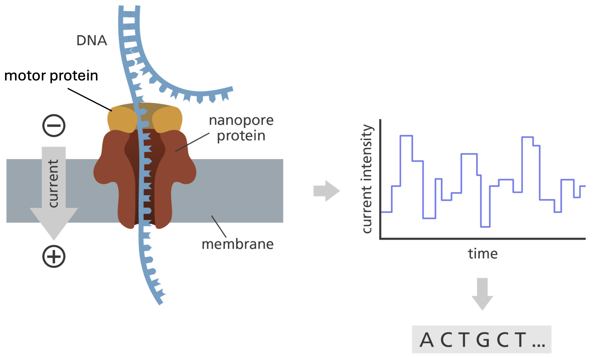

# Matériel et méthodes

## Conception du question d’analyse des pratiques d’élevage

Afin d'identifier les pratiques à risque associés au portage d'entérobactéries productrices de β-lactamases à spectre étendu (E-BLSE) et/ou de carbapénémases (E-CP) dans les élevages porcins de La Réunion, un questionnaire standardisé a été conçu et administré lors de chaque visite d'élevage, en parallèle du prélèvement destiné à l'analyse bactériologique. L'objectif de ce questionnaire était de documenter, pour chaque élevage échantillonné, un ensemble de facteurs susceptibles d'influencer la circulation de bactéries résistantes aux antibiotiques : caractéristiques structurelles de l'élevage, pratiques de biosécurité, usage d'antibiotiques et environnement immédiat de l'exploitation.

Le questionnaire a été structuré en plusieurs sections thématiques, correspondant aux grandes catégories de facteurs de risque classiquement étudiées dans la littérature sur l'antibiorésistance en élevage :

-   Identification de l'élevage : identifiant unique, date de visite, coordonnées de l'éleveur, localisation géographique. Les communes de La Réunion, accueillant des élevages porcins, ont été regroupées en neuf zones géographiques, définies de façon à homogénéiser la couverture de l'échantillonnage sur l'ensemble de; le type d'élevage a également été renseigné (Indépendant, COP, Multiplicateur, Naisseur-engraisseur).

-   Biosécurité : mesures d'hygiène et de désinfection, gestion des accès à l'élevage et autres pratiques susceptibles de limiter, ou au contraire de favoriser, l'introduction et la diffusion de bactéries résistantes au sein du cheptel.

-   Cohabitation avec d'autres espèces animales : présence, sur ou à proximité immédiate de l'élevage, d’espèces animal domestiqué ou non. Ces espèces constituant des sources potentielles de transmission croisée de gènes de résistance.

-   Usage des antibiotiques : les traitements antibiotiques ont été renseignés à deux niveaux de précision:

    -   la famille pharmacologique (pénicillines, amoxicilline, phénicolés, sulfamides, lincosamides, macrolides, pleuromutilines, tétracyclines)

    -   la formule commerciale effectivement utilisée , afin de pouvoir mener l'analyse statistique au niveau de granularité le plus pertinent selon la fréquence d'usage observée sur le terrain.

-   Environnement de l'élevage : caractéristiques du site susceptibles de constituer des facteurs de risque ou de protection additionnels (proximité de points d'eau, gestion des effluents ou encore les activités d’élevage et agricole environnante.).

    Chaque variable a été codée de manière à être directement exploitable statistiquement : Variable qualitatives binaires (Oui/Non, codées 0/1), variables quantitatives continues ou discrètes (effectifs, distances, fréquences), et variables catégorielles à choix multiples pour les items admettant plusieurs réponses (espèces animales présentes, antibiotiques utilisées). L'ensemble des réponses a été saisi dans un tableur structuré, une ligne par élevage, les en-têtes de colonnes reprenant l'organisation thématique décrite ci- dessus.

    Les facteurs de risque potentiellement associés à la présence d'Enterobactérie résistante ont été étudiés à l'échelle de l'élevage et des pratiques. Dans un premier temps, chaque variable explicative a été analysée individuellement à l'aide d'une régression logistique binomiale. Les résultats ont été exprimés sous forme d'odds ratios (OR) et de leurs intervalles de confiance à 95 % (IC95 %). Afin d'éviter l'exclusion prématurée de variables potentiellement pertinentes, les variables présentant une valeur de p inférieure à 0,10 lors de l'analyse univariée ont été retenues pour l'analyse multivariée. Les variables sélectionnées ont ensuite été intégrées dans un modèle de régression logistique multivariée permettant d'identifier les facteurs indépendamment associés à la présence d'EBLSE. Le seuil de significativité statistique a été fixé à p\* \< 0,05.

    Lorsque plusieurs variables étaient retenues pour l’analyse multivariée, leur éventuelle corrélation a été évaluée à l’aide d’un test exact de Fisher appliqué à des tableaux de contingence 2 × 2. Cette analyse visait à identifier d’éventuels phénomènes de confusion susceptibles d’influencer l’interprétation des effets observés après ajustement. Le seuil de significativité statistique a été fixé à p\* \< 0,05.

    L’ensemble des analyses a été réalisé sous R (version 4.6.0).

## Echantillonage

Les prélèvements ont été réalisés entre Mars et juin 2026 dans des élevages porcins de La Réunion dans le cadre d’une étude sur la circulation des entérobactéries productrices de bêta-lactamases à spectre étendu (BLSE). Au total, 89 élevages ont été inclus dans l’étude. L’objectif initial était d’échantillonner l’ensemble des élevages porcins suivis par les équipes du cabinet vétérinaire VétoRun. soit environ 190 exploitations. Toutefois, en raison des contraintes logistiques et temporelles du projet, l’échantillonnage a été limité à 89 élevages. Parmi ceux-ci, 76 élevages ont été échantillonnés directement par l’étudiant selon un protocole standardisé. Dans chaque élevage, trois échantillons ont été collectés :

-   une pédichiffonnette dans le bâtiment hébergeant les porcs charcutiers les plus âgés;

-   une pédichiffonnette dans le bâtiment hébergeant les truies les plus âgées;

-   un écouvillonnage rectal réalisé sur une truie.

Cette stratégie d’échantillonnage visait à maximiser la probabilité de détecter des entérobactéries résistantes aux antibiotiques tout en ciblant les populations bactériennes les plus susceptibles de persister au sein de l’élevage. L’âge influençant la composition du microbiote intestinal et la dynamique des gènes d’antibiorésistance chez le porc [@gaireAgeInfluencesTemporal2023]. Les animaux les plus âgés ont été privilégiés afin de limiter l’influence des populations bactériennes transitoires associées à l’immaturité digestive des jeunes animaux [@leePrevalenceCharacteristicsClonal2021]. Cette approche permet ainsi de cibler préférentiellement les souches présentant une capacité de maintien à long terme dans le troupeau et son environnement.

Les truies constituent un réservoir potentiel de bactéries résistantes du fait de leur présence prolongée dans l’exploitation et de leur rôle dans la circulation des microorganismes entre les différentes bandes d’animaux.

Les porcs charcutiers ont été inclus car ils constituent la principale interface entre l’élevage et la chaîne alimentaire, représentant ainsi la catégorie la plus susceptible de contribuer à l’exposition des populations humaines.

Afin de limiter le risque d’introduction ou de dissémination de microorganismes entre les exploitations, l’ensemble des prélèvements a été réalisé conformément au protocole de biosécurité du cabinet vétérinaire VétoRun. À l’arrivée sur chaque site, le véhicule était stationné dans une Zone de stationnement prévue par le plan de biosécurité. L’opérateur se rendait ensuite dans le sas sanitaire de l’exploitation, où étaient revêtus les équipements de protection individuelle comprenant une combinaison jetable, des pédisacs (surbottes) ainsi que des gants à usage unique. Chaque visite faisait également l’objet d’un enregistrement dans le registre des visiteurs de l’élevage conformément aux procédures de traçabilité en vigueur avant la réalisation des prélèvements. L’accès aux bâtiments n’était autorisé qu’après le respect complet de ces mesures de biosécurité.

Les pédichiffonnettes stériles ont été utilisées pour l’échantillonnage environnemental des bâtiments. Un sac plastique stérile a été placé sur les chaussures de l’opérateur puis recouvert d’une pédichiffonnette stérile. L’opérateur a parcouru la salle d’intérêt jusqu’à ce que la pédichiffonnette soit visiblement souillée par des matières organiques présentes au sol. Celle-ci a ensuite été retirée et placée dans un sachet stérile.

Les écouvillonnages rectaux ont été réalisés à l’aide d’écouvillons contenant un milieu de transport Amies permettant la conservation des bactéries jusqu’à leur traitement au laboratoire. L’utilisation conjointe des pédichiffonnettes et des écouvillonnages rectaux permettait d’obtenir une vision complémentaire de la circulation des bactéries résistantes au sein de l’élevage. Les pédichiffonnettes fournissaient un échantillon représentatif de la contamination bactérienne de l’environnement tandis que les écouvillonnages rectaux permettaient de caractériser directement le portage intestinal individuel.

En complément, 13 élevages appartenant au schéma de sélection porcin ont été inclus dans l’étude à partir d’échantillons collectés par les équipes du cabinet vétérinaire VétoRun. En raison des exigences élevées de biosécurité appliquées dans ces élevages et afin de limiter les interventions extérieures, des échantillons déjà prélevés dans le cadre des contrôles sanitaires et réglementaires ont été réutilisés. Pour ces exploitations, des échantillons de fèces provenant de porcs charcutiers et de truies gestantes étaient disponibles et ont été intégrés à l’analyse.

Les analyses statistiques ont été réalisées à l’aide du logiciel R (version 4.6.0). Les prévalences ont été calculées comme le rapport entre le nombre d’élevages positifs et le nombre total d’élevages échantillonnés. Les intervalles de confiance à 95 % ont été estimés selon la méthode binomiale exacte de Clopper-Pearson à l’aide de la fonction binom.test() du package stats. Les comparaisons de prévalence entre cette étude et les données issues de la littérature ont été réalisées à l’aide d’un test de comparaison de proportions implémenté dans la fonction prop.test() du package stats, sans correction de continuité de Yates (correct = FALSE).Le seuil de significativité statistique a été fixé à p\* \< 0,05.

Des prévalences régionales ont également été calculées pour chaque zone géographique, accompagnées de leurs intervalles de confiance à 95 % estimés comme précédemment par la méthode binomiale. En raison des faibles effectifs observés dans certaines régions, les comparaisons des proportions entre zones géographiques ont été réalisées à l’aide du test exact de Fisher (fisher.test()). Le seuil de significativité statistique a été fixé à p\* \< 0,05. Les représentations graphiques ont été réalisées à l’aide du package ggplot2.

## Microbiologique

### Cultures et isolement des E-BLSE et E-CPE

Les prélèvements réalisés à partir des pédichiffonnettes, écouvillons rectaux et échantillons de fèces ont été mis en incubation dans 200ml de milieu d’enrichissement non sélectif à base d’eau peptonée à 36± 1°C pendant 21 ± 3 heures afin de favoriser la multiplication des bactéries présentes et d’augmenter la sensibilité de détection des entérobactéries résistantes aux antibiotiques.

Après homogénéisation, 10 μL de chaque échantillon a été ensemencé sur une paire de géloses chromogéniques sélectives ChromID® ESBL et ChromID® Carba (bioMérieux) à l’aide d’une anse bactériologique. L’ensemencement était réalisé selon une méthode de striation permettant la dilution progressive de l’inoculum et l’obtention de colonies isolées. Les géloses ont ensuite été incubées à 36± 1°C pendant 21 ± 3 h en aérobiose.

L’utilisation conjointe des milieux ChromID® ESBL et ChromID® Carba visait à détecter les principaux mécanismes de résistance aux β-lactamines chez les entérobactéries. L’utilisation simultanée de ces deux milieux sélectifs permettait ainsi d’assurer une surveillance large des mécanismes de résistance d’intérêt épidémiologique et d’évaluer le rôle potentiel des élevages porcins dans la circulation de bactéries multirésistantes.

Les colonies présentant une croissance sur les milieux ChromID® ESBL et Carba ont été sélectionnées conformément aux recommandations du fabricant. Les colonies rose à bordeaux étaient considérées comme suspectes d’*Escherichia coli*, tandis que les colonies bleu-vert à bleu-gris étaient considérées comme appartenir à d’autres espèces d’*Enterobacterie*, telles que *Klebsiella spp.* ou *Enterobacter spp.*.

Toutes les colonies présentant ces colorations caractéristiques ont été conservées pour les analyses ultérieures. Les colonies blanches ou incolores présentant une morphologie compatible avec celle d’une entérobactérie ont également été examinées. Ces colonies ont été soumises à un test d’oxydase afin de discriminer les bactéries d’intérêts des autres bactéries Gram négatif susceptibles de croître sur les milieux sélectifs. Les colonies présentant un résultat négatif au test de l’oxydase ont été conservées pour la suite des analyses, tandis que les colonies oxydase positives ont été exclues.

Cette stratégie permettait de maximiser la sensibilité de détection des entérobactéries porteuses de mécanismes de résistance de type BLSE ou carbapénémase tout en limitant l’inclusion d’isolats n’appartenant pas à l’ordre des *Enterobacterales*.

Les cultures présentant des colonies suspectes ont été repiquées quotidiennement afin d’obtenir des cultures pures. Pour chaque culture, une colonie isolée présentant une morphologie caractéristique était sélectionnée puis réensemencée sur une gélose ChromID® identique au milieu d’isolement initial. Lorsqu’un même prélèvement présentait plusieurs morphotypes bactériens compatibles avec les bactéries d’intérêt, chaque morphotype était repiqué séparément sur une boîte distincte afin de préserver la diversité des isolats collectés.

Cette opération pouvait être répétée plusieurs fois jusqu’à l’obtention d’une culture considérée comme pure sur la base de l’homogénéité morphologique des colonies observées. Une fois la pureté de l’isolat jugée satisfaisante, l’ensemble de la culture était prélevé à l’aide d’une anse bactériologique puis suspendu dans un milieu cryoprotecteur.

Le milieu de conservation utilisé était un bouillon glycérol-peptone (BGP) com-posé, pour 100 mL de solution, de 1 g de peptone, 0,5 g de chlorure de sodium (NaCl), 25 mL de glycérol et 75 mL d’eau distillée stérile.

Une fois les cryotubes identifiée les isolats bactériens ont ensuite été conservés à-80°C .

### Identification des isolats bactériens

Une première identification bactérienne a été réalisée par spectrométrie de masse MALDI-TOF (Matrix-Assisted Laser Desorption/Ionization Time-of-Flight) en utilisant le Bruker MALDI Biotyper®, selon les recommandations du fabricant,à partir de colonies fraîchement réisolées.

Afin de garantir la qualité de l’identification, les isolats sélectionnés étaient réensemencés depuis le stock sur gélose ChromID® la veille de l’analyse afin d’obtenir des colonies fraîches et pures. Une colonie isolée était déposée dans un puits de la cible MALDI-TOF MS puis séchée à température ambiante. Un volume de 1 µL de matrice HCCA (α-cyano-4-hydroxycinnamic acid) était ensuite appliqué sur chaque dépôt avant séchage complet. La cible était ensuite introduite dans le spectromètre de masse pour l’acquisition des spectres et l’identification bactérienne.

Les spectres protéiques obtenus ont été comparés à la base de données du fabricant (serveur version 5.1.410.7081) afin de déterminer l’identité bactérienne des isolats. Un score supérieur à 2,0 était considéré comme une identification fiable à l’espèce, tandis qu’un score compris entre 1,70 et 1,99 permettait une identification au genre. Les scores inférieurs à 1,70 n’étaient pas considérés comme suffisamment discriminants pour permettre une identification fiable.

L’identification par MALDI-TOF a permis de confirmer rapidement l’appartenance taxonomique des isolats sélectionnés. Les souches identifiées comme n’appartenant pas à l’ordre des Enterobacterales étaient exclues des analyses ultérieures, ce qui permettait d’optimiser les coûts et le temps de travail liés à la caractérisation phénotypique et génomique des isolats d’intérêt.

### Identification des phénotypes de resistance

Un antibiogramme a été réalisé sur chaque isolat selon la méthode de diffusion en gélose Mueller-Hinton, conformément aux recommandations du CA-SFM/EUCAST. Une suspension bactérienne ajustée à une densité de 0,5 McFarland a été préparée dans une solution saline stérile à partir d’une colonie fraîche. La gélose Mueller-Hinton a été ensemencée par écouvillonnage selon trois directions successives (verticale, horizontale puis diagonale) afin d’obtenir un tapis bactérien homogène. 16 disques d’antibiotiques ont ensuite été déposés à la surface du milieu dans un délai maximal de 15 minutes après ensemencement. Les boîtes ont été incubées à 35 ± 2°C pendant 16 à 24 h.

Le @tbl-eucast présente les 16 antibiotiques utilisés, ainsi que la concentration de chaque disque et les critères d'interprétation correspondants.

:::: {#tbl-eucast}
<div>

```{r}
#| label: tab-EUCAST
library(dplyr)
library(gt)

tableau_antibio <- tribble(
  ~Classe,                      ~Antibiotique,                    ~Charge_disque_ug, ~Diam_critique_S, ~Diam_critique_R,
  "Pénicillines",               "Amoxicilline",                   20,                19,                19,
  "Pénicillines",               "Ampicilline",                    10,                14,                14,
  "Pénicillines",               "Ticarcilline",                   75,                23,                20,
  "Pénicillines",               "Amoxicilline / acide clavulanique", 30,             19,                19,
  
  "Céphalosporines",            "Céftazidime",                    10,                22,                19,
  "Céphalosporines",            "Céfépime",                       30,                27,                21,
  "Céphalosporines",            "Céfotaxime",                     5,                 20,                17,
  
  "Fluoroquinolones",           "Ciprofloxacine",                 5,                 26,                24,
  "Fluoroquinolones",           "Ofloxacine",                     5,                 24,                22,
  
  "Aminosides",                 "Gentamicine",                    10,                17,                14,
  
  "Carbapénème",                "Imipénème",                      10,                22,                16,
  "Carbapénème",                "Ertapénème",                     10,                25,                22,
  
  "Tétracycline",               "Tétracycline",                   30,                18,                15,
  
  "Autres antibiotique",        "Colistine",                      10,                18,                15,
  "Autres antibiotique",        "Trimétoprime-sulfaméthoxazole",  25,                14,                11,
  "Autres antibiotique",        "Tigécycline",                    15,                18,                15
)

tableau_final <- tableau_antibio %>%
  group_by(Classe) %>%
  gt() %>%
  cols_label(
    Antibiotique       = "",
    Charge_disque_ug   = "Charge du disque (µg)",
    Diam_critique_S    = md("Diamètre critique (mm) **S ≥**"),
    Diam_critique_R    = md("Diamètre critique (mm) **R <**")
  ) %>%
  tab_style(
    style = cell_text(weight = "bold"),
    locations = cells_row_groups()
  ) %>%
  opt_row_striping() %>%
  tab_options(
    row_group.border.top.width    = px(3),
    row_group.border.top.color    = "black",
    row_group.border.bottom.width = px(3),
    row_group.border.bottom.color = "black",
    table_body.hlines.color       = "transparent"
  ) %>%
  cols_align(
    align = "center",
    columns = c(Antibiotique, Charge_disque_ug, Diam_critique_S, Diam_critique_R)
  )

tableau_final

```

</div>

Table des concentrations en antibiotique utlisées et critères d'interprétation des antibiogrammes selon CA-SFM/EUCAST 2017.
::::

Après incubation, les diamètres des zones d'inhibition autour de chaque disque d'antibiotique ont été mesurés en millimètres. La sensibilité ou la résistance des isolats a ensuite été déterminée par comparaison aux diamètres critiques définis dans les recommandations du CA-SFM/EUCAST 2017 (version 1.0, mars 2017) comme indiqué dans le @tbl-eucast, permettant de classer les souches selon leur profil de sensibilité aux antibiotiques testés.

Une souche était considérée comme productrice de BLSE lorsqu'une synergie caractéristique dite « en bouchon de champagne » était observée entre le disque d’amoxicilline-acide clavulanique et au moins une céphalosporine de troisième ou quatrième génération.

## Génomique

Afin de caractériser les mécanismes génétiques impliqués dans la résistance aux antibiotiques et d’étudier les relations épidémiologiques entre les isolats, un séquençage du génome complet a été réalisé sur les souches bactériennes obtenues.

### Extraction, dosage de l'ADN et Séquençage

Les isolats conservés à -80°C ont été remis en culture sur gélose ChromID® puis incubés à 37°C pendant 18 à 24 heures. Une quantité suffisante de biomasse bactérienne a ensuite été prélevée afin de procéder à l’extraction de l’ADN génomique à l’aide du kit QIAamp DNA Mini Kit (QIAGEN), conformément aux recommandations du fabricant.

Après extraction, la concentration en ADN génomique double brin a été déterminée à l’aide d’un fluorimètre Qubit™ 4 (Invitrogen) associé au kit Qubit™ dsDNA BR Assay Kit, conformément aux recommandations du fabricant. Les échantillons présentant une concentration inférieure à 20 ng·µL�¹ ont fait l’objet d’une nouvelle extraction. Les échantillons dont la concentration était supérieure à ce seuil ont été dilués dans de l’eau sans nucléases (nuclease-free) afin d’obtenir une concentration finale standardisée de 20 ng·µL�¹ nécessaire à la préparation des bibliothèques de séquençage.

Les bibliothèques de séquençage ont été préparées à l’aide du kit Rapid Barcoding V14 (SQK-RBK114.96, Oxford Nanopore Technologies) selon les recommandations du fabricant. Le séquençage génomique a ensuite été réalisé à l’aide de la technologie Oxford Nanopore Technologies (ONT) sur un séquenceur PromethION 2 Solo équipé de flow cells R10.4.1.

::: callout-tip
### Courte introduction au séquencage Nanopore

Le séquençage par nanopores repose sur un principe biophysique distinct des technologies de séquençage par synthèse[@nano1]. Le dispositif consiste en une membrane électriquement isolante traversée par une protéine formant un pore de dimension nanométrique, à travers lequel est appliqué un courant ionique constant sous l'effet d'une différence de potentiel. Lorsqu'une molécule d'acide nucléique simple brin passe à travers ce pore, sous l'action d'une protéine motrice, chaque nucléotide engendre une perturbation caractéristique et mesurable du courant ionique. Cette modulation du signal électrique, enregistrée en temps réel à haute fréquence d'échantillonnage, constitue un signal brut dont l'amplitude et la dynamique dépendent de la composition en bases de la séquence traversant le pore.

Ce signal est ensuite converti en séquence nucléotidique par des algorithmes de basecalling capable d'établir la correspondance entre les variations du courant et l'identité des bases.

{#fig-nanopore}

Cette approche présente l'avantage de permettre le séquençage de molécules longues, sans étape d'amplification préalable, ainsi qu'une analyse en temps réel des données produites. Le séquençage par nanopores présente plusieurs avantages techniques par rapport aux technologies de séquençage à lectures courtes. La longueur des reads produits, pouvant atteindre plusieurs dizaines, voire centaines de kilobases selon la qualité de l'extraction d'ADN, permet de s'affranchir en grande partie des limites posées par les régions répétées et les éléments génétiques mobiles lors de l'étape d'assemblage. En bactériologie, cet avantage est particulièrement déterminant pour l'étude de la résistance aux antimicrobiens : les gènes de résistance sont fréquemment portés par des plasmides ou associés à des éléments transposables et des séquences d'insertion, dont la structure répétée empêche souvent leur résolution complète par assemblage à partir de reads courts. Les longues lectures permettent ainsi d'obtenir des assemblages complets, voire circularisés (génome bactérien et plasmides), et de déterminer sans ambiguïté la localisation génomique (chromosomique ou plasmidique) d'un déterminant de résistance, information essentielle pour évaluer son potentiel de dissémination horizontale.

La principale limite historiquement associée à cette technologie réside dans un taux d'erreur par base supérieur à celui des technologies de séquençage à lectures courtes, en particulier au niveau des régions homopolymériques, où la résolution du signal électrique peine à discriminer précisément le nombre de bases identiques consécutives. Ces erreurs, de nature majoritairement systématique et bien caractérisées, sont néanmoins substantiellement corrigées lors des étapes de contrôle qualité et de correction post-basecalling, au moyen d'outils dédiés. Cela permet d'atteindre une précision de consensus final comparable à celle des technologies de référence.
:::

### Traitement des données de séquençage par bio-informatique

Les données de séquençage ont été générées à l’aide du logiciel MinKNOW (Oxford Nanopore Technologies). La conversion des signaux électriques en séquences nucléotidiques (basecalling) a ensuite été réalisée avec Dorado v1.4.0, en utilisant le modèle haute précision dna-r10.4.1_e8.2_400bps_sup\@5.2.0. Les lectures de faible longueur (\< 200 pb) ont été filtrées à l’aide du logiciel Filtlong afin d'améliorer la qualité des données utilisées pour les étapes ultérieures.

Les génomes ont ensuite été assemblés *de novo* avec Flye v2.9.2, puis corrigés par polissage à l’aide de Medaka v1.11.3 afin de réduire les erreurs résiduelles associées au séquençage Nanopore. Une profondeur minimale de séquençage de 100× a été obtenue pour l’ensemble des isolats.

### Identification taxonomique des isolats

GAMBIT (Genomic Approximation Method for Bacterial Identification and Tracking). Cette méthode repose sur une approche basée sur les k-mers permettant d’assigner une identité taxonomique aux isolats par comparaison avec une base de génomes bactériens de référence et par évaluation de leur proximité génétique.

Le typage génétique des isolats a ensuite été réalisé par Multi-Locus Sequence Typing (MLST). Cette approche repose sur l’analyse des séquences de sept gènes constitutifs conservés et permet l’attribution d’un Sequence Type (ST) à chaque isolat par comparaison à des bases de données de référence.

Pour les isolats appartenant au complexe *Enterobacter cloacae*, une analyse complémentaire a été nécessaire car l’identification génomique réalisée précédemment ne permettait pas une attribution fiable à l’espèce. En effet, les différentes espèces appartenant à ce complexe présentent une forte proximité génomique, ce qui peut limiter leur discrimination par les méthodes d’identification classiques. Les génomes obtenus ont été comparés à une base de génomes de référence représentative des différentes espèces du complexe *E. cloacae* par calcul de l’Average Nucleotide Identity (ANI) à l’aide du logiciel fastANI[@ani]. L’appartenance à une même espèce a été retenue lorsque la valeur d’ANI entre deux génomes était supérieure à 98 %.

### Phylogénie inter compartiments

Afin d'étudier les relations génétiques entre les isolats obtenus et ceux précédemment décrits dans d'autres compartiments de l'approche One Health, les génomes appartenant aux mêmes espèces ont fait l'objet d'analyses comparatives. Les variants nucléotidiques ont été identifiés à l'aide du logiciel Snippy (disponible sur https://github.com/tseemann/snippy ), permettant la détection des polymorphismes nucléotidiques simples (SNPs) par alignement sur un génome de référence adapté à chaque groupe clonal. Cette approche a permis d'évaluer la proximité génétique entre les isolats issus de différents compartiments et d'explorer leur éventuelle circulation entre compartiments.

### Recherche des gènes de résistance aux antimicrobiens

Les déterminants génétiques associés à la résistance aux antibiotiques ont été recherchés à l'aide du logiciel amrfinder v3.12.8 (NCBI). Cet outil permet d'identifier les gènes de résistance acquis ainsi que certaines mutations chromosomiques connues pour conférer une résistance aux antimicrobiens. Les résultats obtenus ont été utilisés pour caractériser le résistome de chaque isolat et compléter les données phénotypiques de résistance.

La localisation plasmidique ou chromosomique des gènes de résistance ainsi que les caractéristiques des plasmides ont été déterminées à l’aide du module MOB-recon du package MOB-suite. Les plasmides reconstruits ont été caractérisés sur la base de leur type de réplication et de leur potentiel de mobilité afin d’évaluer leur contribution potentielle à la dissémination des déterminants de résistance.
