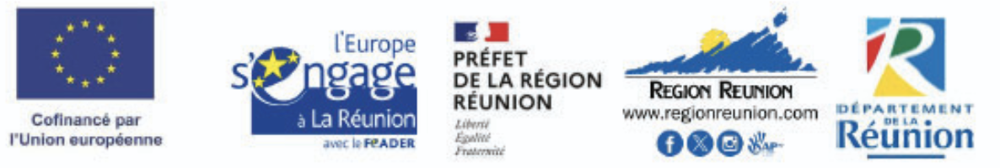

# Remerciements {.unnumbered}

Tout d'abord, je tiens à remercier les docteurs David A. Wilkinson et Maleck Vasseur pour leur confiance, leur accompagnement, leur pédagogie et leur humour infaillible tout au long de ce stage. J'espère qu'un jour j'aurai l'occasion d'accueillir mes propres stagiaires avec autant de bienveillance et aussi chaleureusement que vous

David, merci de m'avoir initié à l'art occulte de la génomique et pour nos conversations parfois lunaires, qui nous ont conduits à rechercher la définition du terme cunicole entre 2 explication de fonctionnalité d’un package R ou d’un de tes 1001 logiciels.

Merci Maleck de m’avoir fait confiance auprès de tes éleveurs, d’avoir pris le temps de m’expliquer ton métier, et sans doute aussi ta passion. J’ai aimé refaire le monde autour d’un carry avec toi.

Je remercie également Thierry Baldet, ainsi que les équipes d’ASTRE et du CIRAD Réunion, qui m’ont accueilli et avec qui j’ai eu la chance de travailler.

Je remercie mes collègues Aubanne, Arthur, Hassan, Inoussa, Kevin, Liz et N'Djojimmon, avec qui science et potin ont sûrement atteint leur paroxysme (peut-être pas dans ce ordre-là). Merci à vous de m’avoir toujours aiguillé professionnellement et pour tous les moments partagés autour d’un repas.

Merci également aux équipes du CYROI et de VétoRun que j’ai eu la chance de côtoyer.-

Je tiens également à remercier chaleureusement tous les éleveurs ayant pris part à cette étude. Merci à eux de m’avoir ouvert leurs portes, et ce toujours avec le sourire. Merci pour les leçons accélérées de réunionnais et pour m’avoir transmis ce qu’est réellement l’hospitalité de l’île. J’espère que ce travail pourra avant tout leur être utile.

Je remercie fortement l’équipe AMR : Anaïs, Isaora et Nina, pour leur temps, leurs conseils et leur aide à tout moment. Je retiendrai surtout l’entraide, la bonne humeur réunionnaise et les savates pigeons En revanche, j’essaierai d’oublier les poubelles qui craquent, la bonne odeur d’un autoclave encore chaud ou la vue d’un lézard séché depuis bien avant mon arrivée, ou même peut-être la vôtre.

P.S. : Jouer (gagner ?) au Skyjo n’aura plus jamais la même saveur sans vous.

**Financement**\
Ce stage de recherche a été réalisé dans le cadre du projet FEADER Santé et Biodiversité financé par l'Union européenne, l’État et la Région Réunion. L'Europe s'engage à La Réunion avec le FEADER dont le Département Réunion est autorité de gestion.



<!--# Ne pas supprimer le code ci-dessous qui produit la table des matières. Supprimer la liste des tableaux si elle est inutile -->

```{=latex}
%Table des matières
\tableofcontents
%Liste des tableaux
\listoftables
% Liste des figures
\listoffigures
```
