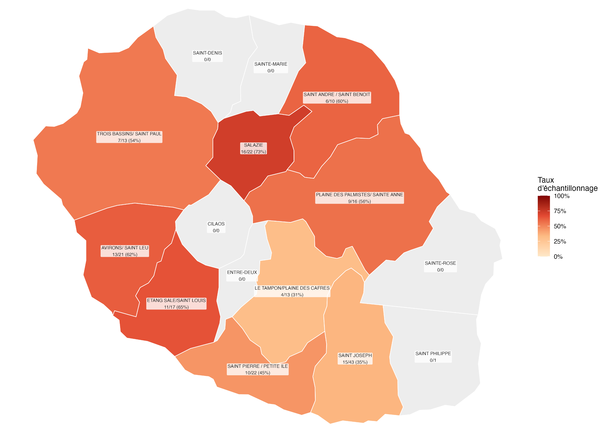
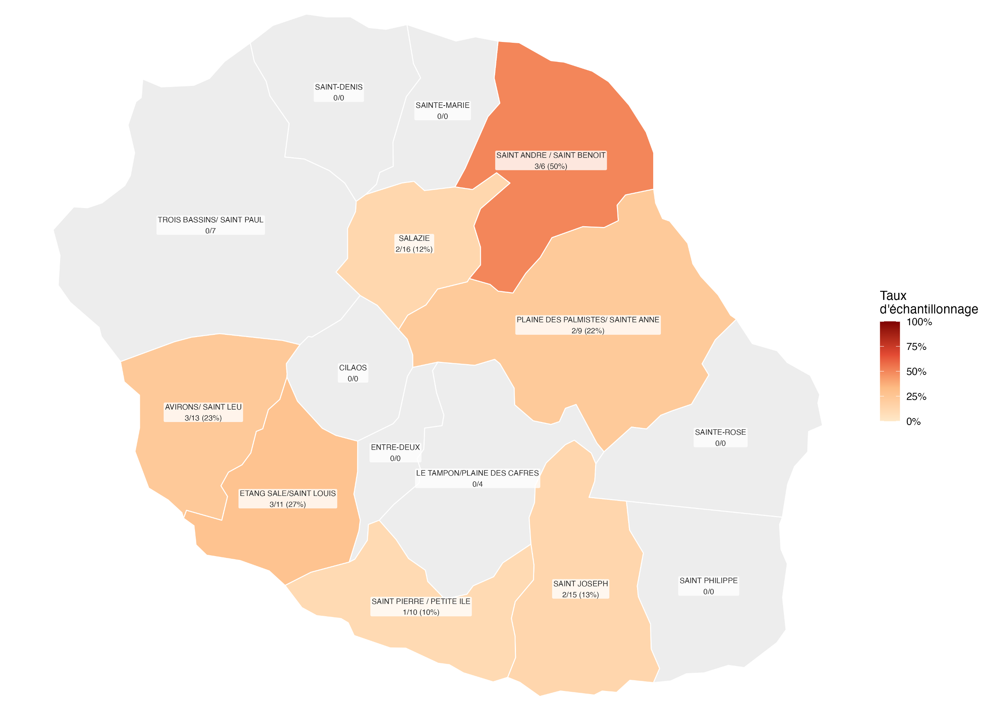
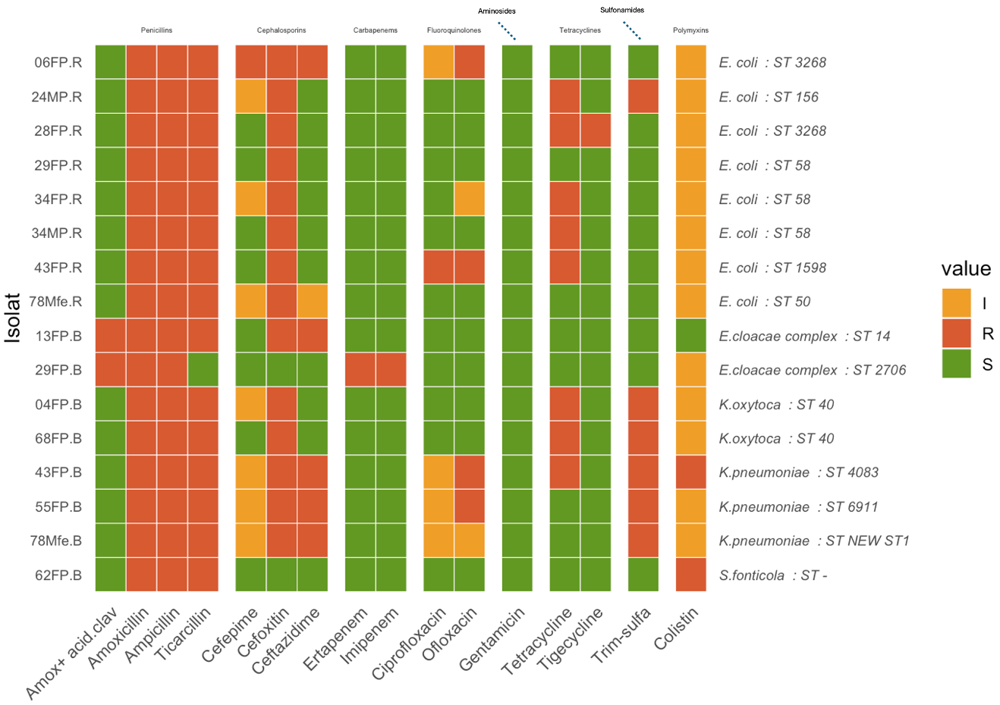
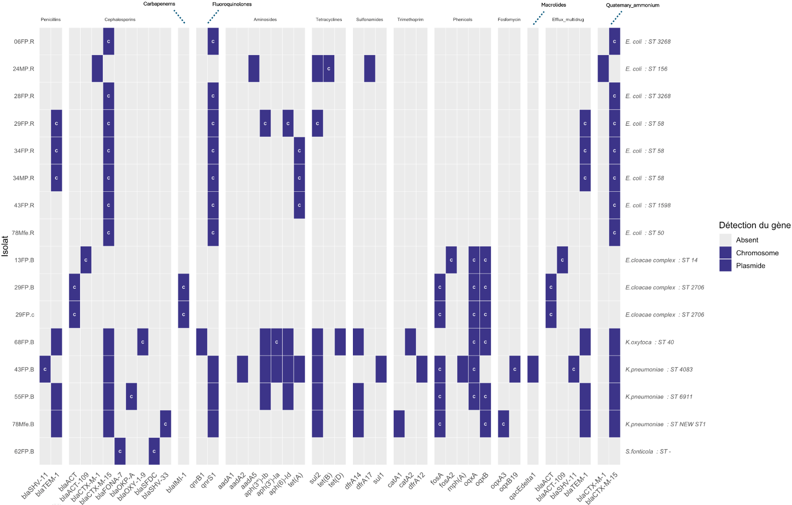
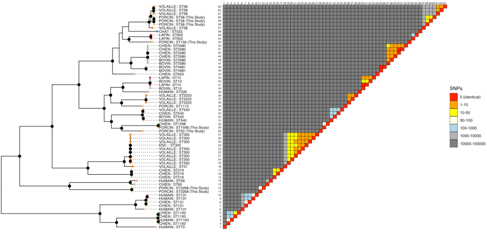
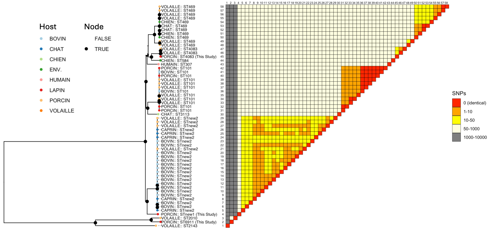
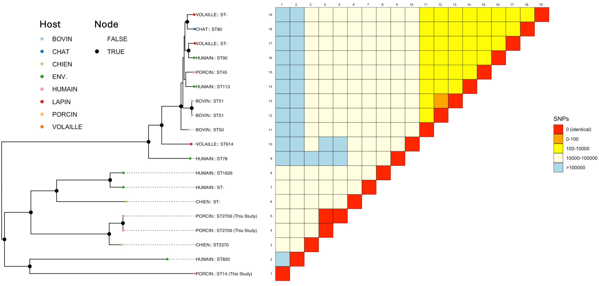

# Résultats

## Prévalence

Au cours de la période d’étude, un total de 249 échantillons a été collecté au sein de 89 élevages porcins.
Après culture sélective et identification, 16 isolats d’entérobactéries résistantes ont été obtenus issus de 12 élevages positifs.

La @fig-map1 présente la stratégie d'échantillonnage retenue pour cette étude.

{#fig-map1}

Aucun résultat positif n'a été obtenu par la technique d'écouvillonnage, cette dernière étant probablement d'une sensibilité insuffisante dans un contexte comme celui de La Réunion.

Ces résultats permettent d'estimer une prévalence en élevage de 13,5 % (IC95 % : \[7,5 ; 22,8\]).
Cette prévalence est significativement inférieure à celles rapportées dans deux études antérieures menées à La Réunion, qui estimaient respectivement une prévalence de 53,3 % (IC95 % : \[35,1 ; 71,5\]) des élevages porcins positifs pour des entérobactéries productrices de BLSE [@Farm2018] et de 50,0 % (IC95 % : \[31,3 ; 68,7\]) pour les élevages porcins hébergeant des E.
coli producteurs de BLSE [@miltgenOneHealthCompartmental2022].
Les comparaisons de prévalence, réalisées à l’aide d’un test exact binomial de comparaison de proportions, ont mis en évidence une différence statistiquement significative avec les deux études (p\* \< 0,001 pour les deux comparaisons; @fig-stat1 ).
Ces résultats suggèrent une diminution marquée de la prévalence des élevages porcins positifs pour les BLSE à La Réunion au cours des huit dernières années, avec une prévalence environ quatre fois plus faible que celle rapportée précédemment.

::: {#fig-stat1}
```{r}
#| label: nom_figure

library(ggplot2)

n <- 89          
x <- 12           

n1 <- 30        
x1 <- 16         

n2 <- 30         
x2 <- 15 
p <- x/n
p1 <- x1/n1
p2 <- x2/n2

test1 <- prop.test(
  x = c(x, x1),
  n = c(n, n1),
  alternative = "two.sided",
  correct = FALSE
)
test2 <- prop.test(
  x = c(x, x2),
  n = c(n, n2),
  alternative = "two.sided",
  correct = FALSE
)

etudes <- data.frame(
  etude = factor(c("Gay et al (2016)", "Miltgen et al (2018)", "Notre étude (2026)"),
                 levels = c("Gay et al (2016)", "Miltgen et al (2018)", "Notre étude (2026)")),
  prevalence = c(p1, p2, x/n),
  n = c(n1, n2, n)
)

#IC
ic <- t(mapply(function(x, n) {
  res <- binom.test(x, n)$conf.int
  c(lower = res[1], upper = res[2])
}, x = c(x1, x2, x), n = c(n1, n2, n)))

etudes$lower <- ic[, "lower"]
etudes$upper <- ic[, "upper"]

# --- p-values issues de vos tests ---
p_test1 <- test1$p.value  # Étude 1 vs Notre étude
p_test2 <- test2$p.value  # Étude 2 vs Notre étude

signif_label <- function(p) {
  if (p < 0.001) return("***")
  if (p < 0.01) return("**")
  if (p < 0.05) return("*")
  return("ns")
}

# --- Graphique ---
ggplot(etudes, aes(x = etude, y = prevalence, fill = etude)) +
  scale_fill_brewer(palette = ("Paired"))+
  geom_col(width = 0.6, color = "black") +
  geom_errorbar(aes(ymin = lower, ymax = upper), width = 0.15, linewidth = 0.6) +
  geom_text(aes(label = paste0(round(prevalence*100, 1), "%")),
            vjust = -2.5,hjust = -0.4, size = 4) +
  # Barre de significativité Étude1 vs Notre étude
  annotate("segment", x = 1, xend = 3, y = max(etudes$upper) + 0.05,
           yend = max(etudes$upper) + 0.05) +
  annotate("text", x = 2, y = max(etudes$upper) + 0.07,
           label = signif_label(p_test1), size = 5) +
  # Barre de significativité Étude2 vs Notre étude
  annotate("segment", x = 2, xend = 3, y = max(etudes$upper) + 0.12,
           yend = max(etudes$upper) + 0.12) +
  annotate("text", x = 2.5, y = max(etudes$upper) + 0.14,
           label = signif_label(p_test2), size = 5) +
  scale_y_continuous(labels = scales::percent, limits = c(0, max(etudes$upper) + 0.2)) +
  labs(x = NULL, y = "Prévalence en élevage") +
  theme_minimal(base_size = 13) +
  theme(legend.position = "none",plot.title= element_text(hjust=0.5) )

```

Graphique de l'évolution de la prévalence en entérobactérie résistante en fonction du temps.
:::

Afin d'explorer un potentiel effet spatial de la prévalence, la répartition des élevages positifs a été analysée à l'échelle des différentes zones de production porcine de l'île.
La @fig-map2 montre la prévalence des élevages par région d’échantillonnage.

{#fig-map2}

La majorité des zones échantillonnées présentaient des proportions d'élevages positifs relativement faibles et comparables, généralement comprises entre 10 et 20 %.
La zone Saint-André/Saint-Benoît présentait la prévalence apparente la plus élevée, avec 50 % d'élevages positifs (3/6), alors que les autres secteurs affichaient des valeurs plus faibles.

Cependant, les intervalles de confiance associés à ces estimations étaient larges et largement chevauchants en raison des faibles effectifs disponibles dans chaque zone, comme montré dans la @fig-stat2.
En conséquence, aucune différence statistiquement significative de prévalence n'a été mise en évidence entre les régions (test exact de Fisher, p\* = 0,47).
Les effectifs régionaux étaient insuffisants pour déterminer si la prévalence variait réellement selon la localisation géographique des élevages.
Ces résultats ne permettent pas d'identifier un foyer géographique particulier de circulation des entérobactéries résistantes à l'échelle de l'île.
La distribution observée est davantage compatible avec une circulation diffuse au sein de la filière porcine réunionnaise qu'avec une concentration de la résistance dans un nombre limité d'élevages ou dans une région spécifique.
Néanmoins, la prévalence observée dans la zone Saint-André/Saint-Benoît justifie que ce secteur fasse l'objet d'une attention particulière dans le cadre de futurs travaux impliquant des effectifs plus importants.

::: {#fig-stat2}
```{r}
#| label: stat ANOVA
library(tidyverse)
library(binom)

region <- c(
  "Saint_Andre_Benoit",
  "Plaine_Palmistes_Sainte_Anne",
  "Salazie",
  "Avirons_Saint_Leu",
  "Etang_Sale_Saint_Louis",
  "Saint_Pierre_Petite_Ile",
  "Saint_Joseph",
  "Trois_Bassins_Saint_Paul",
  "Tampon_Plaine_Cafres"
)

pos <- c(3,2,2,3,3,1,2,0,0)
neg <- c(3,7,14,10,8,9,13,7,4)
df <- data.frame(
  region = region,
  pos = pos,
  neg = neg
)
tab <- df[,2:3]


df$n <- df$pos + df$neg


df$prop <- df$pos / df$n


ic <- binom.confint(
  x = df$pos,
  n = df$n,
  methods = "exact"
)

df$lower <- ic$lower
df$upper <- ic$upper

ggplot(df,
       aes(x = reorder(region, prop),
           y = prop)) +

  geom_col(fill = "#E67E22") +

  geom_errorbar(
    aes(ymin = lower,
        ymax = upper),
    width = 0.15
  ) +

  coord_flip() +

  scale_y_continuous(
    labels = scales::percent_format()
  ) +
  labs(
    x = "",
    y = "Prévalence",
  )
  
```

Graphique de la prévalence par commune.
:::

## Facteurs de risque

Une analyse univariée par régression logistique a été réalisée afin d'identifier les facteurs associés au portage d'entérobactéries productrices de β-lactamases à spectre étendu (E-BSL).
Parmi les variables étudiées, deux présentaient une association avec le statut E-BSL pour un seuil de sélection fixé à p\*\< 0,20 : la présence d'un point d'eau à moins de 100 m de l'élevage et le respect de la marche en avant.

La présence d'un point d'eau à moins de 100 m était associée à une augmentation du risque de présence de bactérie résistante dans l’élevage (OR = 4,06 \[0,92 ; 16,5 \]; p\* = 0,052).
À l'inverse, le respect de la marche en avant était associé à une diminution du risque (OR = 0,23 \[0,06 ; 0,87\] ; p\* = 0,030).

Ces deux variables ont ensuite été intégrées dans un modèle de régression logistique multivarié.
Après ajustement, la proximité d'un point d'eau à moins de 100 m demeurait associée à une augmentation du risque, bien que cette association ne soit plus statistiquement significative (OR ajusté = 2,83 \[0,58 ;12,38\] ; p\* = 0,174).
De même, l'effet protecteur de la marche en avant persistait après ajustement mais n'atteignait plus le seuil de significativité statistique (OR ajusté = 0,30 \[0,07 ;1,19\] ; p\* = 0,082).

Une analyse de contingence a mis en évidence une association significative entre la présence d'un point d'eau à moins de 100 m et le respect de la marche en avant (OR = 0,235 \[0,06 ; 0,95\] ; p\* = 0,034).
Les élevages situés à proximité d'un point d'eau appliquaient moins fréquemment la marche en avant que les autres élevages.
Cette association suggère l'existence d'un effet de confusion partiel entre ces deux variables, susceptible d'expliquer en partie la diminution de leur significativité observée dans le modèle multivarié.

Les résultats détaillés des analyses univariée, multivariée et de corrélation sont présentés en @sec-annex1.

Une analyse de puissance a *posteriori* a été réalisée pour les deux facteurs retenus à l'issue de l'analyse univariée.
La puissance statistique obtenue était de 55,9 % pour la variable « marche en avant » et de 42,9 % pour la variable « présence d'un point d'eau à moins de 100 m ».
Ces valeurs sont inférieures au seuil de 80 % généralement recommandé pour assurer une capacité suffisante à détecter une association lorsqu'elle existe réellement.
Ces résultats suggèrent que l'étude était probablement sous-dimensionnée pour mettre en évidence certains facteurs associés à la présence d’entérobactérie résistante.
Ainsi, la perte de significativité observée après ajustement pourrait résulter à la fois d'un effet de confusion entre les variables étudiées et d'un manque de puissance statistique lié au faible nombre d'élevages positifs inclus dans l'analyse.
En effet, bien que les associations identifiées en analyse univariée aient conservé la même direction après ajustement, les intervalles de confiance se sont élargis et les p-values ont augmenté.
Néanmoins, la proximité d'un point d'eau demeure un facteur de risque associé au portage d'entérobactéries résistantes, tandis que le respect de la marche en avant demeure associé à une diminution du risque.
L'absence de significativité statistique après ajustement doit donc être interprétée avec prudence.

## Identification des souches résistantes

Parmi les 16 souches isolées, cinq appartenaient au genre *Klebsiella*, dont deux *Klebsiella oxytoca* et trois *Klebsiella pneumoniae*.
Huit souches ont été identifiées comme *Escherichia coli*, une souche comme Serratia fonticola et deux souches comme appartenant au complexe *Enterobacter cloacae*.
Le @tbl-ID présente la répartition détaillée des espèces bactériennes identifiées.

::: {#tbl-ID}
```{r}
  #| label: Identification des souches bactériennes résistantes isolées
  
  library(readxl)
  library(dplyr)
  library(gt)
  library(scales)
  
  ID<- read_excel("analyse_donnees/DATA_Final.xlsx", sheet = 3)
  ID<-ID[,1:10]
  Culture<-read_excel("analyse_donnees/DATA_Final.xlsx", sheet = 1)
  Culture <- Culture %>%
    filter(if_any(c(PN_ESBL, PN_CARBA), ~ . == 1))
  Culture<-Culture[, c(13, 9, 11)]
  
  ID<- left_join(Culture, ID, by = names(ID)[1])
  ID<- as.data.frame(ID)
  ID$contigs <- NULL
  ID$genome_size <- NULL
  ID$N50 <- NULL
  
  table_identification <- ID %>%
    transmute(
      isolat_ID,
      #PN
      'Culture_ESBL'  = ifelse(PN_ESBL == 1, "Positive", "Negative"),
      'Culture_CARBA' = ifelse(PN_CARBA == 1, "Positive", "Negative"),
      # MALDI
      Identification_MALDI = `ID-maldi`,
      Score_MALDI,
      
      Niveau_MALDI = case_when(
        is.na(Score_MALDI) ~ "ND",
        #Score_MALDI == 0 ~ "Non Déterminé",
        Score_MALDI >= 2.30 ~ "Espèce++",
        Score_MALDI >= 2.00 ~ "Espèce",
        Score_MALDI >= 1.70 ~ "Genre",
        TRUE ~ "Non fiable"
      ),
      
      # MLST
      Scheme = scheme,
      ST,
      
      # Gambit
      Identification_Gambit = Gambit
      
    )%>%
    mutate(
      groupe_espece = case_when(
        grepl("coli", Identification_Gambit, ignore.case = TRUE) ~ "Escherichia coli",
        grepl("oxytoca", Identification_Gambit, ignore.case = TRUE) ~ "Klebsiella oxytoca",
        grepl("pneumoniae", Identification_Gambit, ignore.case = TRUE) ~ "Klebsiella pneumoniae",
        TRUE ~ "Autre"
      ),
      groupe_espece = factor(
        groupe_espece,
        levels = c("Escherichia coli",
                   "Klebsiella oxytoca", "Klebsiella pneumoniae", "Autre")
      )
    ) %>%
    arrange(groupe_espece, ST, isolat_ID) %>%
    # isolats retenus
    slice(1:17)%>% 
    select(-groupe_espece)
  
  # Création de la figure-table
  fig_identification <- table_identification %>%
    
    gt() %>%
    
    tab_spanner(
      label = md("**Culture Selective**"),
      columns = c(
        Culture_ESBL,
        Culture_CARBA,
      )
    ) %>%
    
    tab_spanner(
      label = md("**MALDI-TOF**"),
      columns = c(
        Identification_MALDI,
        Score_MALDI,
        Niveau_MALDI
      )
    ) %>%
    
    tab_spanner(
      label = md("**MLST**"),
      columns = c(
        Scheme,
        ST
      )
    ) %>%
    
    tab_spanner(
      label = md("**Gambit**"),
      columns = c(
        Identification_Gambit
      )
    ) %>%
    
    cols_label(
      isolat_ID = "Isolat",
      Culture_ESBL="Culture",
      Culture_CARBA="Culture",
      Identification_MALDI = "Identification",
      Score_MALDI = "Score",
      Niveau_MALDI = "Niveau",
      Scheme = "Schéma",
      ST = "ST",
      Identification_Gambit = "Identification"
    ) %>%
    tab_style(
      style = list(
        cell_fill(color = "grey85"),
        cell_text(weight = "bold")
      ),
      locations = cells_body(
        columns = c(Score_MALDI, Niveau_MALDI),
        rows = Niveau_MALDI == "Non Déterminé"
      )
    ) %>%
    tab_style(
      style = list(
        cell_fill(color = "#1a9850"),
        cell_text(color = "white", weight = "bold")
      ),
      locations = cells_body(
        columns = c(Score_MALDI, Niveau_MALDI),
        rows = Niveau_MALDI == "Espèce++"
      )
    ) %>%
    
    tab_style(
      style = list(
        cell_fill(color = "#66bd63"),
        cell_text(color = "white", weight = "bold")
      ),
      locations = cells_body(
        columns = c(Score_MALDI, Niveau_MALDI),
        rows = Niveau_MALDI == "Espèce"
      )
    ) %>%
    
    tab_style(
      style = list(
        cell_fill(color = "#fdae61"),
        cell_text(color = "white", weight = "bold")
      ),
      locations = cells_body(
        columns = c(Score_MALDI, Niveau_MALDI),
        rows = Niveau_MALDI == "Genre"
      )
    ) %>%
    
    tab_style(
      style = list(
        cell_fill(color = "#d73027"),
        cell_text(color = "white", weight = "bold")
      ),
      locations = cells_body(
        columns = c(Score_MALDI, Niveau_MALDI),
        rows = Niveau_MALDI == "Non fiable"
      )
    ) %>%
    
    
    opt_row_striping() %>%
    
    #tab_header(
    # title = md("**Identification des isolats par MALDI-TOF, MLST et Gambit**")
    # ) %>%
    
    tab_source_note(
      source_note = md(
        "*Les niveaux de confiance MALDI sont basés sur les seuils d'identification Bruker Biotyper.*"
      )
    ) %>%
    
    tab_options(
      table.font.size = px(12),
      heading.align = "center",
      table.width = pct(100)
    )
  
  if (knitr::is_latex_output()) {
    # Réduction de la police de caractère en PDF
    fig_identification %>%
      tab_options(table.font.size = px(7))
  } else {
    fig_identification
  }
  getwd()
```
  
  Tableau d'identification des souches bactériennes résistantes par MALDI-TOF, MLST et GAMBIT
:::


L'analyse MLST a montré qu'aucun schéma MLST n'était disponible pour la souche 62FP.B identifiée comme *Serratia fonticola*.
Cela s'explique par l'absence, à ce jour, de schéma MLST de référence validé pour cette espèce dans les bases de données consultées.

Concernant la souche 78Mfe.B, aucun Sequence Type (ST) connu n'a pu être attribué et le résultat a été rapporté comme « New ST ».
Cela indique que la combinaison allélique observée n'a encore jamais été enregistrée dans les bases de données de référence, notamment celles du NCBI et de l'Institut Pasteur.
Cette souche pourrait ainsi représenter un nouveau profil génétique.

Pour les deux souches appartenant au complexe *Enterobacter cloacae*, les résultats d'identification obtenus par MALDI-TOF et par l'outil GAMBIT n'étaient pas concordants.
Cette divergence peut être expliquée par la forte proximité génétique existant entre les différentes espèces composant le complexe *E. cloacae*, ce qui rend leur discrimination difficile, même à l'aide de méthodes moléculaires ou protéomiques avancées.

Afin de résoudre ces discordances taxonomiques et d'obtenir une identification plus précise au niveau de l'espèce, une analyse phylogénomique complémentaire a été réalisée pour les souches initialement attribuées au complexe *Enterobacter cloacae*.
Les résultats de cette analyse sont présentés dans la @fig-ani.

::: {#fig-ani}
```{r}
#| label: id_snippy
if (!requireNamespace("BiocManager", quietly = TRUE))
+     install.packages("BiocManager")

BiocManager::install("ggtree")
library(ggplot2)
library(ggtree)
library(ape)
library(aplot)
library(openxlsx)
get_tips=function(tree=NULL){
  d = fortify(tree)
  d = subset(d, isTip)
  tips=rev(with(d, label[order(y, decreasing=T)]))
  return(tips)
}
ani=read.table("analyse_donnees/tabs/ANI.tab")
colnames(ani)=c("from","to","ANI","hits","comparisons")
ani$group=cut(ani$ANI,c(0,90,95,98,100))
ani$from=gsub(".fasta","",ani$from)
ani$to=gsub(".fasta","",ani$to)
md=read.xlsx("analyse_donnees/tabs/metadata.xlsx")
ani$from <- gsub("(29FP)_", "\\1.", ani$from)
ani$to <- gsub("(29FP)_", "\\1.", ani$to)
ani$from2=md$name[match(ani$from,md$accession)]
ani$to2=md$name[match(ani$to,md$accession)]
dist=as.dist(xtabs(100-ANI ~ from2+to2,ani))
hc=hclust(dist)
ani$from2=factor(ani$from2,hc$labels[hc$order])
ani$to2=factor(ani$to2,hc$labels[hc$order])
phy=as.phylo(hc)
phy=hc
tr=ggtree(phy)
tip_order <- get_tips(phy)
id_df <- data.frame(label = tip_order, id = seq_along(tip_order))
id_lookup <- setNames(id_df$id, id_df$label)
tr2 <- tr %<+% id_df +
  geom_tiplab(aes(label = paste0(label,":",id)), size = 2,align = TRUE, linetype = "dotted",hjust=0) +
  hexpand(2)
ani$from2 <- factor(ani$from2, levels = get_tips(phy))# met les axes dans le bon ordre
ani$to2   <- factor(ani$to2,   levels = get_tips(phy))#
ani2 <- ggplot(ani) +
  subset(ani, as.numeric(from2) <= as.numeric(to2))+ #avoir que la moitier haute
  geom_tile(aes(x = from2, y = to2, fill = group), colour = "grey50") +
  coord_equal() +
  scale_fill_manual(
    values = c("grey90", "lightyellow", "lightblue", "green"),
    labels = c("<90%", "90-95%", "95-98%", ">98%"),
    name = "Average Nucleotide Identity"
  ) +
  scale_x_discrete(position = "top", labels = function(x) id_lookup[x]) +
  theme(
    axis.text.x = element_text(size = 5),
    axis.text.y = element_blank(),
    axis.ticks.y = element_blank(),
    axis.title.y = element_blank(),
    axis.title.x = element_blank(),
    legend.position = c(0.80, 0.30),
    legend.title = element_text(size = 8),
    legend.text = element_text(size = 7),
    legend.key.size = unit(0.5, "cm"),
    
    panel.background = element_rect(fill = "white", colour = NA) #couleur du fond hahahaa
  )
tr2+ani2
```

Matrice de similitude (méthode ANI) pour l'identification taxonomique des souches appartenant au complexe *Enterobacter cloacae*.
:::

Cette approche a permis d'affiner l'identification taxonomique des isolats étudiés.
Ainsi, la souche 29FP.B a été rattachée à l'espèce *Enterobacter sichuanensis*, tandis que la souche 13FP.B a été identifiée comme appartenant à l'espèce *Enterobacter ludwigii*.

## Analyse du phénotype de résistance (antibiogramme)

Les 16 antibiogrammes ont été réalisés, puis les résultats ont été compilés en @fig-pheno

{#fig-pheno}

De manière générale, cette analyse met en évidence une résistance élevée aux β-lactamines parmi les isolats étudiés.
La majorité des souches présentaient une résistance à l'amoxicilline et à la ticarcilline, confirmant un phénotype compatible avec la production de β-lactamases à spectre étendu (BLSE).
La résistance à l'amoxicilline-acide clavulanique observée uniquement chez les isolats appartenant au complexe *Enterobacter cloacae* était attendue, cette espèce présentant une résistance intrinsèque à cette association du fait de la production d'une céphalosporinase chromosomique de type AmpC, faiblement inhibée par l'acide clavulanique.

À l'inverse, la quasi-totalité des isolats demeurait sensible aux carbapénèmes, notamment à l'imipénème et à l'ertapénème.
Cette observation suggère l'absence de carbapénémase fonctionnelle chez la majorité des souches étudiées et confirme que ces molécules conservent une activité efficace contre ces entérobactéries productrices de BLSE.
Ce qui concorde avec la non utilisation de ce type d'antibiotique en médecine vétérinaire.
Une exception notable a toutefois été observée pour l'isolat 29FP.B, qui présentait une résistance à l'imipénème et à l'ertapénème.
Cette observation est cohérente avec son isolement sur un milieu sélectif contenant un carbapénème.
Cet isolat représente donc une souche d'intérêt particulier et constitue un signal de vigilance sur le plan épidémiologique, justifiant des investigations complémentaires visant à identifier les mécanismes moléculaires impliqués dans cette résistance.

Concernant les céphalosporines de troisième et quatrième génération, une résistance au céfotaxime a été observée chez l’ensemble des isolats d’*Escherichia coli* et de *Klebsiella spp.*.
Ce résultat était attendu compte tenu de la stratégie d’isolement mise en œuvre, fondée sur la sélection d’entérobactéries productrices de β-lactamases à spectre étendu (BLSE).
La résistance au céfotaxime confirme ainsi le phénotype BLSE recherché et la pertinence de la méthode de sélection utilisée.
En revanche, les profils obtenus pour le céfépime et la ceftazidime apparaissaient plus hétérogènes selon les isolats.
Cette variabilité pourrait refléter des différences dans le type de β-lactamase portée, son niveau d’expression ou la présence de mécanismes de résistance complémentaires, conduisant à des profils de sensibilité distincts entre les souches.

Enfin, l'ensemble des isolats de *Klebsiella* présentaient une résistance au triméthoprime-sulfaméthoxazole, non retrouvé chez les autres souches.
Cette résistance n'est pas décrite comme un caractère intrinsèque chez ce genre bactérien et résulte généralement de l'acquisition de déterminants génétiques spécifiques.

Les autres familles d'antibiotiques présentaient des profils de résistance plus variables.
Des résistances aux fluoroquinolones, notamment à la ciprofloxacine et à l'ofloxacine, ont été observées chez plusieurs isolats.
Les résistances aux tétracyclines concernaient quant à elles un sous-groupe plus restreint de souches.
La sensibilité à la gentamicine demeurait globalement conservée dans l'ensemble de la collection.

Concernant la colistine, une proportion importante d'isolats a été classée dans la catégorie « intermédiaire », tandis qu'un isolat présentait un profil résistant.
Ces résultats doivent néanmoins être interprétés avec prudence.
En effet, la méthode utilisée dans cette étude n'est pas considérée comme la plus adaptée à l'évaluation de la sensibilité à la colistine et peut conduire à des erreurs de classification.
Cela est dû au mode d'action particulier de la colistine (formation de pores dans les membranes bactérienne).
Les recommandations actuelles privilégient la détermination de la concentration minimale inhibitrice (CMI) par microdilution en bouillon, qui constitue la méthode de référence pour cet antibiotique.
Par conséquent, les profils observés pour la colistine nécessiteraient une confirmation par une méthode standardisée avant toute conclusion définitive.

Enfin, 11, soit 68,75 %, des souches isolées sont multirésistantes, c’est-à-dire qu’elles présentent une résistance à au moins un antibiotique dans au moins trois classes d’antibiotiques différentes.
Les profils de résistance observés associaient plusieurs classes d’antibiotiques, témoignant d’une accumulation de déterminants de résistance au sein d’une même souche.
Cela constitue un signal fort de santé publique

## Analyse du génotype de résistance (gènes détectés)

{#fig-geno}

La souche 04FP.B présentait un profil génétique atypique associé à une qualité d’assemblage insuffisante.
La présence simultanée de nombreux déterminants chromosomiques et plasmidiques incompatibles avec l’identité taxonomique attribuée suggérait une contamination de l’échantillon ou de l’assemblage.
Cette souche a donc été exclue des analyses génomiques ultérieures.
Le criblage génomique des autres isolats a mis en évidence une importante diversité de déterminants de résistance ainsi qu’une distribution variable entre chromosome et plasmides selon les espèces bactériennes.

Chez les isolats d'*E. coli*, le profil génotypique est dominé par la détection quasi-systématique de blaCTX-M-15 et de qnrS1, tous deux portés par le chromosome.
Le gène blaCTX-M-15 constituait le principal déterminant associé au phénotype BLSE observé.
Par ailleurs, plusieurs isolats appartenant au ST58 présentaient des combinaisons distinctes de gènes de résistance malgré une même affiliation clonale.
Cette variabilité suggère une importante plasticité génomique au sein de cette lignée, compatible avec la capacité d’adaptation fréquemment décrite pour ce clone largement distribué à l’échelle internationale.
Chez les isolats du complexe *Enterobacter cloacae*, la présence des gènes blaACT, fosA et oqxAB correspondait au profil génétique classiquement observé dans ce groupe bactérien.
Les gènes blaACT codent des céphalosporinases chromosomiques dont l’expression basale est généralement suffisante pour conférer une résistance aux aminopénicillines, sans nécessairement entraîner une résistance aux céphalosporines de troisième génération.
Une telle résistance apparaît habituellement à la suite d’une surexpression ou d’une dérégulation de ces enzymes.

L’un des isolats d’*Enterobacter cloacae* portait également le gène de carbapénémase blaIMI-1.
Bien que localisé sur le chromosome, ce gène ne peut être considéré comme intrinsèque.
Il est associé à l’élément intégratif mobile EcloIMEX, connu pour favoriser l’acquisition et la perte de ce déterminant au sein du complexe *E. cloacae*.
La détection de blaIMI-1 explique le phénotype de résistance observé vis-à-vis des carbapénèmes.
Sa présence dans un isolat issu d’un élevage porcin apparaît particulièrement remarquable compte tenu de l’absence d’utilisation des carbapénèmes en production porcine.
Cela suggère que ce déterminant pourrait résulter d’échanges entre compartiments écologiques et constitue un marqueur potentiel de circulation intersectorielle de bactéries ou de gènes de résistance.

Enfin, plusieurs isolats de *Klebsiella pneumoniae* et *Klebsiella oxytoca* partageaient un plasmide de type IncFIB portant notamment blaCTX-M-15, blaTEM-1, dfrA14, qnrS1, aph(3'')-Ib, aph(6)-Id et sul2.
La co-localisation de ces gènes sur un même plasmide favorise leur co-sélection lors de l’exposition à l’une de ces familles d’antibiotiques et souligne le rôle potentiel des plasmides IncFIB dans la dissémination des déterminants de résistance au sein des entérobactéries.
Toutefois, malgré la présence des gènes aph, aucun phénotype de résistance aux aminosides n’a été observé chez les isolats concernés, suggérant une absence d’expression ou une expression insuffisante de ces déterminants dans les conditions testées.

## Étude phylogénomique de l’interconnexion des compartiments

{#fig-den1}

La @fig-den1 met en évidence la proximité génétique marquée entre les isolats d’*Escherichia coli* ST58 issus des élevages porcins et ceux provenant des autres compartiments étudiés.
Ce résultat est cohérent avec les données de la littérature, qui décrivent le ST58 comme une lignée largement distribuée dans différents réservoirs animaux, environnementaux et humains.
Son caractère ubiquiste suggère une capacité d'adaptation à des hôtes et environnements variés, favorisant sa dissémination entre compartiments.

{#fig-den2}

La @fig-den2 met en évidence une forte proximité génétique entre l'ensemble des isolats de *Klebsiella* pneumoniae, avec des distances génomiques inférieures à 100 SNPs.
Cette faible divergence suggère l'existence d'une origine commune récente ou la circulation d'un même pool génétique à l'échelle de l'île.
Ainsi, les isolats porcins ne constituent pas une lignée spécifique mais s'intègrent dans un ensemble plus large de souches circulant à La Réunion, suggérant que le compartiment porcin participe à une dynamique insulaire de circulation de *Klebsiella* plutôt qu'à un réservoir indépendant.
Par ailleurs, une proximité génétique particulièrement marquée est observée entre les isolats appartenant au ST4083 issus des compartiments porcin et avicole, ce qui pourrait refléter l'existence d'un réservoir commun ou de voies de diffusion partagées entre ces deux compartiments.
Ces observations appuient l'hypothèse d'une circulation à l'échelle de l'île plutôt que d'une population bactérienne strictement confinée au secteur porcin.

{#fig-den3}

La @fig-den3 suggère que, contrairement aux observations réalisées pour *Escherichia coli* et *Klebsiella spp.*, les isolats porcins appartenant au complexe *Enterobacter cloacae* ne présentent pas de proximité génétique marquée avec les souches issues des autres compartiments étudiés.
Les isolats porcins se regroupent au sein de lignées phylogénétiques distinctes et ne partagent pas de faibles distances SNP avec les isolats humains, animaux ou environnementaux inclus dans l'analyse.
Cette absence de similarité génétique suggère une circulation plus limitée de ces lignées entre les différents compartiments à l'échelle de La Réunion.
Les résultats obtenus indiquent ainsi que les isolats porcins du complexe E.
cloacae pourraient être associés à un réservoir davantage spécifique au compartiment porcin.

À l'inverse, les isolats d'*E. coli* et de *Klebsiella spp.* apparaissent plus étroitement liés à des souches provenant de multiples hôtes, suggérant une circulation plus importante entre les différents compartiments étudiés.
